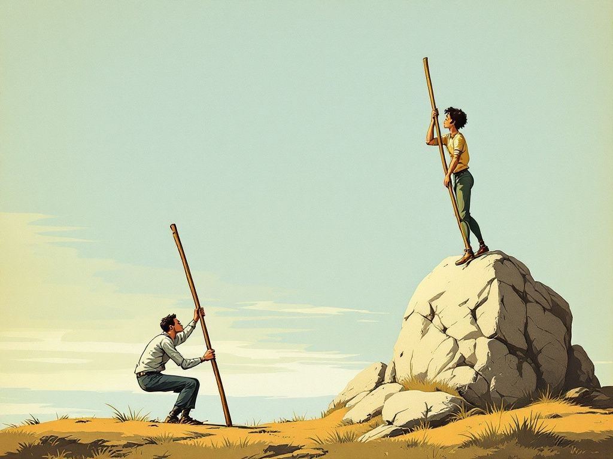

+++
title = "A Crutch and a Lever"
date = 2026-06-05
description = "The same model is a crutch or a lever depending on what you hand it: the work, or the friction. Same stick. Opposite physics."
images = ["/og/a-crutch-and-a-lever.png"]
summary = "The same model can remove effort or apply resistance. A practical test for whether your AI habit is a crutch or a lever."
tags = ["ai-policy", "alignment", "prompt-engineering"]
semantic_id = "v4MuRJyJYqN53J3c_7C2Wso6VM4-wAm2"
related_by_meaning = ["/glossary/alignment/", "/deep-dives/why-the-sephora-bot-has-no-floor/", "/blog/the-weights-are-free-the-forklift-isnt/", "/blog/i-got-substituted-on-purpose/"]
+++

A crutch and a lever, photographed side by side, are nearly the same object: a length of
something rigid. You cannot tell them apart until somebody leans. Lean one way and the stick
holds you up. It takes weight off a thing that's broken so it can heal, or off a thing that's
perfectly fine so it can slowly forget how to carry itself. Put a fulcrum under it and lean the
other way and the same stick multiplies a force you're already putting in: you push a little, the
world moves a lot. Same stick. Opposite physics. The difference was never in the wood.

That's the distinction I care about in how people use AI, so let me make it annoying and
specific.

<!--more-->

## The crutch

Most people meet the tool in crutch position, because that's the position the interface sells you.
A blank box that says _ask me anything_. So you ask, and it answers. Write my email. Summarize
this. Give me five ideas for the thing. Out comes a competent, plausible, faintly weightless
paragraph; you ship it; you move on; nothing is wrong, exactly.

What you got was the average. A model [trained](/glossary/machine-learning/) on everyone's email hands you the
centroid of everyone's email: the most-likely next word, which is by construction the _least
surprising_ one. It is the middle of the road, and the middle of the road is where all the traffic
is. Perfectly fine for a permission slip. Quietly fatal for anything that was supposed to sound
like you.

The hidden charge, because it never shows up on the invoice, was a rep. You
had a small chance to do a hard small thing (find the words, make the call, sit in the discomfort
of a blank page for ninety seconds) and you handed it to the stick. Do that once, no harm. Do it
forty times a day for a year and you are, in the most literal muscular sense, getting _weaker_ at
the exact thing you were trying to get done. The tool did the moving. You devolved a notch, and the
worst part is how good it felt.

Not every task deserves your soul. Sometimes you genuinely just need the boilerplate, the regex,
the polite decline to the
fourth meeting, and flexing your own bicep there isn't virtue, it's vanity with a deadline. A
crutch is not a sin. A crutch is a medical device. The problem is the people walking around on two
of them who have forgotten they were ever issued legs.

## The lever

The other position is the one the interface never advertises, so most people never find it. And
this is the part that finally made me write this down: they don't believe it's there. Because they
use the tool as a vending machine, they assume everyone does. "He used AI" can only mean "he
pressed the button and pasted what fell out." They've stood in the one lit corner of the arcade
their whole lives and concluded that's the arcade.

Lever position is the opposite verb. You don't hand it the work. You hand it the _friction_. You
bring the take (fully formed, yours, possibly wrong) and you say _find the crack_. You bring the
draft and instead of _make this better_ you say _what's the question this is dodging_. You make it
argue. You make it the sparring partner who's read everything and is too polite by default, so you
spend half the session telling it to hit harder.

What comes out the far side is not its words. It's yours, after three rounds with something that
refused to let the lazy version stand. The voice is _more_ you, not less, because you had to defend
it to keep it. I have had this thing talk me out of sending messages I'd have regretted for years,
not by writing me a smoother one, but by asking, quietly, _is that true, and who is it actually
for._ That is not a ghostwriter. That is a lever. I pushed; it handed me back more push.



## How to tell which one you're holding

By the output, every time. The crutch's product is smooth and frictionless and could have come from
anyone alive: statistically plausible, zero grounding, all surface. (I have a
whole other post about [the afternoon a chatbot served me
that exact texture with a straight face and a coupon](/blog/everyone-deserves-a-mascara-treat/).) The lever's product has fingerprints on it.
Yours. You can feel the places where you fought it.

So the tool was never the variable. You knew that already; I'm sorry to be the one. The same model,
the same subscription, the same blinking box is a crutch or a lever depending on what happens to
the friction. Did it take the hard part away before you touched it, or give your thinking
something hard enough to push against? Hand it the work and you'll get the average of everyone,
and lose, one frictionless rep at a time, the muscle that made you worth reading. Hand it the
resistance and you'll get _yourself_ back, sharper, having done the one thing the machine still
cannot do for you, which is be you on purpose. One produces a smooth answer. The other leaves
fingerprints where you argued.

That's a test for the interaction. The separate question - what's left that's yours once the
machine does all the labor - is the one I put [my own name on](/blog/i-got-substituted-on-purpose/).

Two sticks. Identical in the photo. Pick up the one with the fulcrum under it.
