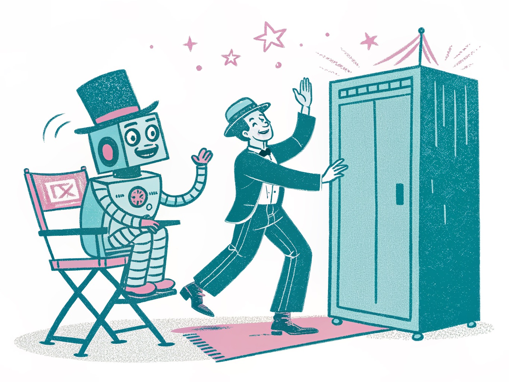

+++
title = "I Got Substituted on Purpose"
date = 2026-06-07
description = "By the strict definition I've already been replaced: I don't write a line of the code. So why do I do more, not less?"
images = ["/og/i-got-substituted-on-purpose.png"]
summary = "By the strict definition, I've already been replaced: I don't write a line of the code that ships under my name. The machine does the typing. So why do I do more, not less? Because the typing was never the job, and 'augmentation vs substitution' is the wrong axis for knowledge work. The right one is whether the thing it took was the labor or the judgment."
tags = ["labour", "machine-learning"]
semantic_id = "o5aTDYwhBh1YRLzMoaOVGZ5PTL-0YAnZ"
related_by_meaning = ["/blog/replicator-was-never-the-point/", "/blog/a-crutch-and-a-lever/", "/blog/karaoke-throws-away-the-words/"]
+++

Let me hand the prosecution its best evidence first, because I'm tired of watching that
argument get made badly.

There's a tidy little test for whether a tool augmented you or replaced you. Augmentation:
you still do the thing, the tool just makes you faster at it. Substitution: the tool does
the thing, and you don't. Calculator next to an accountant, augmentation. Calculator
instead of the accountant, substitution. Clean. Now point it at me.

I do not write the code that ships on this site. Not a line. I don't read it for pleasure
and I couldn't reconstruct most of it from memory if you held a permission slip to my head.
The [machine](/glossary/machine-learning/) writes it. I describe what I want, I look at what comes back, I say yes or no
or "that's not it, do it again," and at no point do my hands touch the syntax. By the tidy
little test, that's not augmentation with an asterisk. That's the whole substitution, lights
out, case closed. The thing that used to be a programmer's job, I outsourced entirely to a
program.

So why do I feel like I got a promotion?

<!--more-->

## The part that actually got substituted

I want to concede this all the way, because the version of me that's reassuring about it is
lying to you. Real things got taken, and they're not coming back, and a couple of them I miss.

The typing got taken. The remembering-the-exact-incantation got taken, the flag, the
argument order, the name of the method nobody can ever recall. The forty-minute detour to
read the docs for a library I'll touch once got taken. The specific, hard-won, deeply
personal skill of staring at an error message until it confesses, that got taken too, and
that one stings a little, because I knew people who were _artists_ at it.

If your definition of the job is the keys going down, I have been replaced completely and I
am not going to insult you by pretending the keys still matter. They don't. The framing crew
shows up and the house gets framed and the hammer never once finds my hand. That's not a
metaphor I'm reaching for. That's just Tuesday.

## The part that didn't

Here's the thing nobody tells you about the general contractor, the person whose name is on
the permit for a house he did not personally nail together: he is not the framing crew that
got bigger. He's a different job that was always sitting one level up, waiting for the labor
below it to get cheap enough that the judgment became the whole point.

The GC doesn't swing the hammer. The GC decides where the wall goes, notices the wall is
going in the wrong place, knows that "wrong place" is even a thing two weeks before the
inspector would, and has the taste to say "no, tear it out, I don't care that it's done." You
have never once heard someone say the contractor got _replaced_ by the framing crew. The crew
is how the house gets built. The contractor is why it's the right house.

That's the move that breaks the tidy little test. The test assumes there's one job and the
tool either does it or helps you do it. But the moment the labor gets handed off, a thing
that was hiding inside the labor the whole time steps forward and turns out to have been the
actual work: deciding. Knowing what "right" looks like before there's anything to look at.
Saying no to a result that is technically complete and quietly wrong. I have
killed a checkpoint that did everything I asked
because doing everything I asked was the problem. No machine on Earth was going to make that
call for me, because the call _was_ me. It's the one thing in the building that doesn't have
a button.



## The wrong axis

So I think "augmentation versus substitution" is a real distinction asking a fake question,
at least for any work that was ever more than its keystrokes.

The honest axis isn't whether the tool did the thing or helped you do it. It's _which thing
it took_. Take the labor, all of it, please, I'll hold the door. Take the typing, the recall,
the boilerplate, the forty-minute docs detour. None of that was ever you. What you should
guard with your life is the judgment, because the day a tool takes _that_ over, you weren't
doing the job, you were holding a place in line for it.

And that's the test that actually tells you something, the one you can run on yourself on a
bad afternoon. Not "did it do the work" but "did it do the _deciding_." If you handed it the
labor and kept the call, you got leveraged, you're a contractor now whether you wanted the
title or not. If you handed it the call and kept the labor, you got the worst trade in the
building: you're still sweating, and you're sweating in service of a judgment that isn't
yours. That's not substitution and it's not augmentation. That's just doing the dumb half on
purpose.

This is the same stick I keep picking up from a different end. I've got a
whole other post about how the identical model is [a crutch or a
lever](/blog/a-crutch-and-a-lever/) depending on whether you hand it the work or the friction. This is that argument with
my own name in the docket: I handed it _all_ the work, every keystroke, and I came out the far
side more leveraged, not less, because the work was never where I lived. I lived one floor up,
in the yes and the no.

## What, me worry

The fear underneath all of this, the one that makes people cling to the keys, is that if the
machine does the doing then there's nothing left of you but a guy pointing at things. And
look, sometimes that's exactly what got exposed: if the doing was all you had, the doing
leaving is going to feel like dying.

But I'd gently suggest that the pointing was the expensive part the entire time. We just
couldn't see it, because it came bundled with the labor, the way the steering came bundled
with the horse. We took the horse away and a lot of people are standing in the road insisting
they've been replaced, when what actually happened is somebody finally handed them a wheel and
asked where they wanted to go. I got substituted on purpose, at the keys, completely. Ask me
the real question. Ask me who's deciding.

Still me. On purpose. That part doesn't have a button, and I checked.
