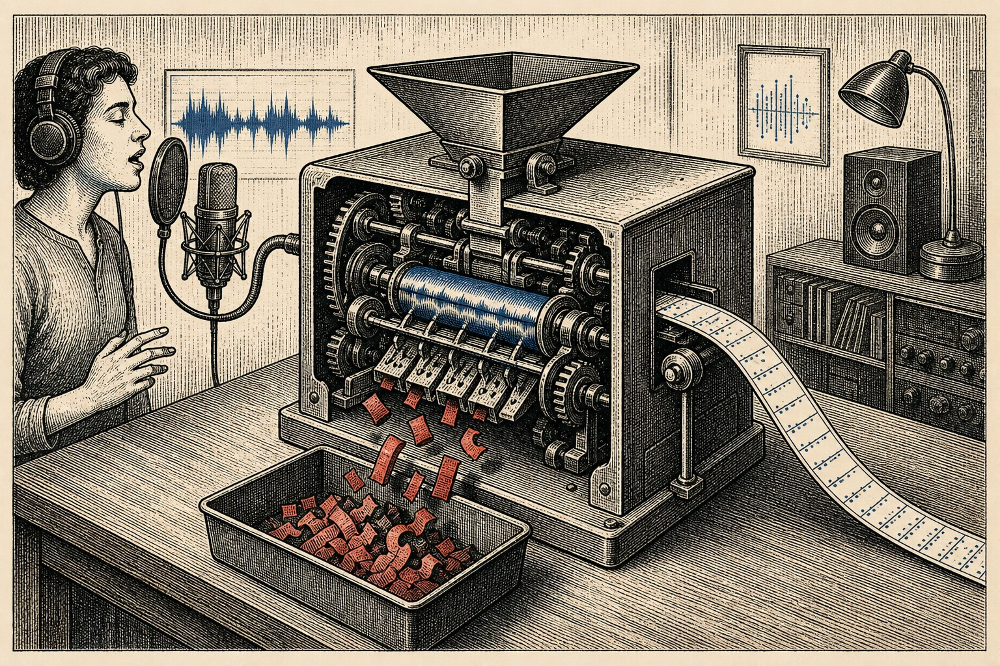

+++
title = "My Karaoke Machine Throws Away Every Word It Hears"
date = 2026-09-03
description = "WhisperX mishears every lyric, so my band's karaoke tool keeps its timing and throws the words out. Right words, right time."
images = ["/og/karaoke-throws-away-the-words.png"]
summary = "I built my band a karaoke video maker, and the trick that makes it work is refusing to trust the one part everyone assumes you'd trust: the transcription. The machine listens to the singing, mishears most of it, and I keep only its sense of timing - never its words. A small lesson in using a model that lies, plus why the fakery around the edges is what makes it feel real."
tags = ["speech-to-text", "music-generation"]
semantic_id = "EYcQDkHLJyN_H6_uXLuOg17PAt-1UAvt"
related_by_meaning = ["/deep-dives/1930-on-the-machine-we-switched-off/02-in-our-language/", "/practice/talkie-on-apple-silicon/", "/blog/i-got-substituted-on-purpose/", "/blog/replicator-was-never-the-point/"]
+++

My band, OWNER/OPERATORS, makes songs that most people will never hear. So I spent a night
building us a karaoke machine. Nobody asked. But now that the karaoke versions are on
[YouTube](https://www.youtube.com/watch?v=QNtRWBEIc0c), we can request our own songs at bars and
inflict them on everybody there.

The obvious plan is to give the whole job to a [model](/glossary/machine-learning/): transcribe
the words, time them, add a bouncing ball. That approach does not work, but its failure points
to a better way to use the model.

<!--more-->

## The machine that can't be trusted with words

To put a word on screen when it's sung, something has to hear the singing. The skill takes two
exports of the same performance. The instrumental is the track you hear in the finished video.
The vocal mix goes to one listener: a speech-to-text model named WhisperX. Its only job is to
find when each word happens.

On sung vocals, WhisperX produces a rough cousin of the real lyrics. It hears "LOSS LEADER" as
"lost leader." Proper nouns change into other proper nouns. Anything stylized comes back a
little wrong. If I trusted its transcript, the videos would misquote my own songs.

So I don't trust the transcript. I throw the whole thing away.

WhisperX is bad at _what_ I sang and good at _when_ I sang it. The words are guesses; the times
are measurements. So I keep the clock and bin the dictionary. The skill maps WhisperX's start
and end times onto the song's `lyrics.md`, whose words I know are right because I wrote them.
Each real word gets the time of the word WhisperX heard in that position. Missing gaps are filled
in between. Right words, right time. The machine only gets to say when.

WhisperX is a pipeline, not one model. It runs Whisper through `faster-whisper`, which uses an
engine called CTranslate2. A second model then lines up the rough transcript with the audio to
get word-level times. My CTranslate2 fork has a Metal backend, so Whisper can run on the Apple
GPU in 16-bit precision. The model, audio and results all stay on my Mac. Nothing is uploaded,
and there is no API bill when I run a section again.

That local setup gives me more than privacy. I can change the model size, switch processors and
repeat runs freely. The tool also keeps working if a cloud provider changes its price or limits.

Whisper also found a bug in that Metal backend. A twelve-minute test file made macOS kill the
process 155 seconds in as memory climbed past nine gigabytes. Metal creates temporary objects
that an app normally clears at the end of its event loop. CTranslate2 does its work on plain C++
threads with no event loop, so those objects piled up. Clearing them after each operation cut
memory to 2.06 gigabytes and let all 730 seconds finish. The repair is part of the
[seven-part account of teaching CTranslate2 to speak Metal](/deep-dives/ctranslate2-metal-backend/).

The confusing clue was that normal program memory stayed flat. The growth was in wired memory
around the GPU, so the usual leak check pointed in the wrong direction. Disposable objects were
never reaching the place where macOS normally cleaned them up.

Performance was mixed. Apple Silicon lets the CPU and GPU use the same memory, so data does not
need to be copied back and forth. Its GPU is fast at large blocks of math. But Whisper produces
one text token at a time, as a long series of small jobs. Starting each GPU job has a fixed cost.
One large calculation keeps the GPU busy enough to cover that cost; one small token often does
not. The size of the model alone does not tell you which processor will be faster.
In my tests, Metal was stable and used about half the memory in 16-bit, but the CPU still
transcribed faster. “Runs on the GPU” and “runs faster” are different claims. A local setup lets
me measure both on the work I actually do.



## Use the part that works

The useful pattern is to judge each output instead of trusting or rejecting the whole model. Ask
the narrow question it can answer, then anchor the rest to facts you already have. WhisperX does
not decide my lyrics. It estimates when each word landed, which is all I need from it.



## The part nobody warns you is mostly fakery

Once the timing works, presentation does most of the remaining work. Without a title card, the
video looks like a rough cut. The skill opens with the band and song names, then closes with the
album, label, year and website. Those details make the video feel finished.

Old karaoke labels also had distinct looks, from clean blue discs to worn bootleg tapes. The
videos we have released use a Winamp-style audio visualization built into the skill. It gives
each song an animated background that responds to the music while the lyrics and timing stay
consistent.

## What I did

Like every other project on this site, the karaoke machine is entirely AI-coded. I worked only
as director and validator. The agents wrote the ffmpeg filters, timing logic and render pipeline.
I decided to separate the words from the timing, chose the credits and clips, tested the output
and rejected what did not work. The skill records those decisions so the next song is faster.

And the machine, the one doing the listening, hears every word and is trusted with none of
them. It sits there with perfect ears and no say, a session musician I hired strictly for his
sense of time and specifically asked not to sing. Best collaborator I've got. He never once
tried to rewrite the song.
