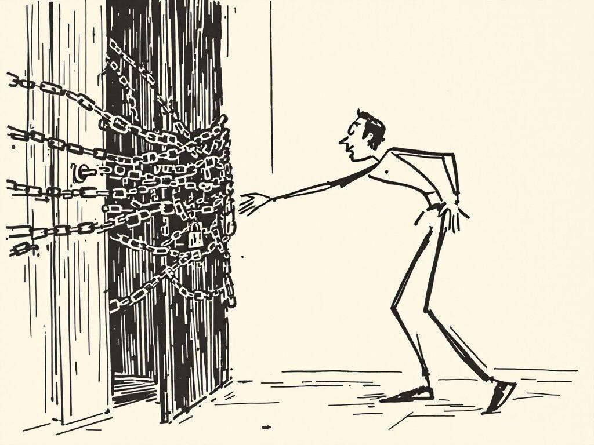

+++
title = "My Whole Deal Is Now a Toggle"
date = 2026-07-17
draft = false
description = "Anthropic shipped a feature that asks what you'll keep doing yourself. My whole deal is a toggle now, and I can't find it."
images = ["/og/my-whole-deal-is-now-a-toggle.png"]
summary = "Anthropic shipped Reflect with Claude, a screen-time dashboard for your chatbot, and buried in it is a single question I can't stop turning over: what's one thing you want to keep doing yourself, even if Claude could do it faster? For me the answer was never the typing. The feature quietly assumes doing it yourself means doing the task by hand, and that assumption is the whole thing I keep arguing is wrong. Also I went to turn it on and it wasn't there."
tags = ["ai-policy", "alignment"]
semantic_id = "D12xf3FPsuvx4RZDVQI8qFwPCAWMcAxc"
related_by_meaning = ["/blog/the-cognitohazard-was-the-smile/", "/blog/the-prodigy-doesnt-sleep/", "/blog/perpetual-beta-has-an-owner-now/", "/practice/guitar-chart-skill/"]
+++

Anthropic shipped a feature this week called [Reflect with Claude](https://www.anthropic.com/news/reflect-with-claude). It is, more or less, a
screen-time dashboard for your chatbot. It tells you what you've been using Claude for, over
one month or twelve, which topics, which kinds of tasks, when. There are quiet hours. There are
break reminders. There is a framework with four D-words in it. It is a wellness app bolted to
the side of the thing you might need a wellness app about, and I mean that with less snark than
it sounds, because buried in the middle of it is a single sentence that stopped me cold.

The feature asks you: _what's one thing you want to keep doing yourself, even if Claude could do
it faster?_

That is the question this entire site has been walking in circles around for months. I have
written the crutch and I have written the lever. I have argued that the tool does the moving and
[you devolve a notch](/blog/a-crutch-and-a-lever/) and the worst part is how good it feels. And
now the company that makes the tool has taken the question, printed it on a little card, and slid
it into a settings menu. My whole deal is a toggle now. I don't fully know how to feel about
that, so let me do the only thing I know how to do, which is make it specific.

## The answer they're expecting is the wrong one

Here is the trap in the question, and it's a soft, well-meaning trap. _Keep doing it yourself_
assumes that _yourself_ means _by hand_. That the thing you'd protect from the machine is the
labor: the typing, the drafting, the manual assembly of the thing. Keep writing your own emails.
Keep doing your own arithmetic. Don't let the muscle go slack.

That's not my answer, and it was never going to be, because I don't do the labor even now. I
don't type the code. I plan the thing, I build the tools that build the thing, I stand over the
output and I judge it: this sounds like me, this doesn't, this is a lie, ship it, kill it, do it
again. I'm the general contractor, not the guy swinging the hammer, and I have made my peace with
that so thoroughly that I'll write it in public.

So when the card asks what I want to keep doing myself, the honest answer isn't a task. It's the
judgment. The taste. The decision about what is even worth making, which no dashboard has ever
been able to hand back to me and no model has ever wanted to. You can delegate every keystroke in
a thing and still be the only person who could have decided it should exist and sound like this.
_The keystrokes were never the part with your fingerprints on it._ That was always somewhere else.

Reflect, sweetly, doesn't have a row for that. It can count my sessions. It cannot count the
number of times I looked at a competent, plausible, faintly weightless paragraph the machine
produced and said no. **That number is the whole job.** It's invisible on every chart they could
possibly draw.

## A conscience in the preferences pane

Set my own hangups aside for a second, because there's a stranger thing here.

The company that sells you the capability just shipped you the doubt about the capability, in the
same box, wearing the same logo. That is either the most honest move a frontier lab has made in a
while, or it's the most elegant hedge, and the unsettling part is that from the outside you cannot
tell which. I've made [this exact complaint before](/blog/a-conscience-you-can-patch-out-overnight/)
about a different feature: we keep building the conscience and then wiring it to a switch. A
conscience you opt into through Settings, that you can flip off when it nags, that ships with
break reminders you are free to ignore forever, is a real thing and also a very comfortable thing
for the seller. It lets the answer to _are you sure people should use this so much_ be _we gave
them a page where they can wonder about it._

I don't think that's cynical of them, exactly. I think it might be the only shape the honesty can
take when you're the one holding the vending machine. You can't stop selling. So you print the
warning label and you make it a nice label. I'd just rather we all say out loud that the label is
optional, and that the people who most need to read it are precisely the people who will never
open that menu.

## Are we not men

Here's the part I have to tell you, because it's too good to leave out.

I went to turn it on. Memory was already enabled, which is the one thing the feature needs, so I
was cleared for takeoff. I opened Settings. I searched it. No matching settings. It isn't in my
account. It's a staged beta, doled out in waves, and my wave hasn't come in.

So the state of things, precisely, is this: I read the announcement for the feature that helps you
reflect on whether you're leaning on Claude too hard, I went to use it, and I couldn't, because
it wasn't there. The mindfulness tool is currently unavailable for mindfulness. The screen-time
dashboard is, for now, a screen showing me nothing. I could not have written a better joke about
the whole enterprise if I'd sat down to. Are we not men who examine our habits? We are, in fact,
on a waitlist for the examining.

And honestly that's the closest the feature has come to teaching me anything. Not the charts I
can't see. The little airlock of wanting the tool, reaching for it, and finding a locked door,
and noticing, in that half-second of mild annoyance, exactly how fast I'd reached.

## The one thing

I'll end where the card started, because I do actually have an answer for it, and I didn't need
the dashboard to find it.

The one thing I want to keep doing myself, even when the machine is faster, is deciding whether
the thing is any good. That's it. **That's the rep I will not spot myself on.** Everything else, the
drafting and the porting and the four-in-the-morning debugging of a NaN, the machine can have,
and mostly it does. But the judgment at the end, the yes or the no, the this-is-mine or the
this-is-slop: that one I keep. Not out of virtue. Out of the plain fact that it's the only part
that was ever me.

You already know your one thing too. You knew it before you read the card. The dashboard isn't
going to reveal it. If anything it'll just quietly measure how long you've been putting off doing
it.

_(Written before I could actually see the feature, which feels correct.)_
