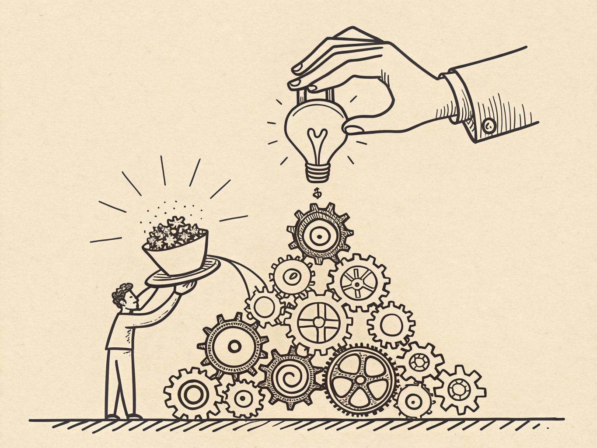

+++
title = "Nobody's Hands Are Big Enough"
date = 2026-06-12
images = ["/og/nobodys-hands-are-big-enough.png"]
description = "A frontier model is more leverage than anyone has ever held. We put it on a download page. The infant in this story is us."
summary = "We keep asking whether the model is safe. Wrong question. The question is whether any person can be handed that much power, and the answer, the one we've spent all of human history building institutions to enforce, is no. A short argument about the gap between what you can set in motion and what you can hold."
tags = ["ai-safety", "alignment", "gpt"]
semantic_id = "_eOJCa7DxYXIl-z73X6u0QtGtZ7owAou"
related_by_meaning = ["/glossary/alignment/", "/blog/is-that-what-you-wanted/", "/practice/172-witnesses/", "/why/", "/glossary/model-welfare/", "/deep-dives/1930-on-the-machine-we-switched-off/01-in-its-own-language/"]
+++

Picture the smallest person you love. For me it's an infant, a sister you could lose in the
crook of one arm, new enough that the hands open and close on nothing. You would not hand her a
lit match, or the car keys, or anything loaded. Not because she's dangerous. She is the least
dangerous person in the building. You hold her back because the distance between what she could
set in motion and what she could understand is the entire world, and closing one inch of it is
the only thing the word _responsibility_ has ever meant.

I want to talk about a thing we keep handing her, every few months, and calling it a launch.

<!--more-->

## What the thing actually is

We argue so hard about whether [these models](/glossary/gpt/) are smart, or conscious, or [aligned](/glossary/alignment/), or coming for
our jobs that we walk clean past the larger fact on the table. A frontier model is _power_, not
a metaphor for it. The thing itself, in a form no king or church ever held.

Think about what it compresses into a chat box. Every science at a working level, every
language, the tireless competence of a thousand specialists who never sleep and never ask why.
It can be copied a million times by lunch and pointed at a million targets by dinner. Power used
to mean men and time: an army, a treasury, years. This collapses all of it into a download. One
person, one afternoon, leverage that used to require a state.

I am not speaking from the cheap seats. This week I watched one of these models write a working
GPU backend for [CTranslate2](https://github.com/eaglstun/CTranslate2), serious inference software,
in one afternoon, for about a hundred and fifty dollars, in a language I cannot read a line of.
That is the cozy, domestic version of the power: someone with no training reached for a credit
card and got, in an afternoon, a thing this serious open-source project had gone its whole life
without. It wasn't missing for lack of wanting. It was missing because the doing was hard: the
few engineers on earth who can build a thing like this bill in the tens of thousands and book
out for months. That was the going rate on hard, and this week it fell to a hundred and fifty
dollars. Now picture the same lever aimed at something that isn't a software library.

That is not a product. It is closer to a natural force we figured out how to bottle, and the
bottle has a friendly logo and a free tier.

## The question we keep refusing to ask

So the industry asks: is the model safe? Is it aligned? Did it pass the evals? Good questions,
all aimed one inch left of the real one. The model doesn't act alone. Someone holds it. And the
question we tiptoe around, because the answer is inconvenient, is not _is the machine
trustworthy_ but _is the person holding it trustworthy with this much_.

The honest answer is no. Not the worst of us. Not the best of us either. Nobody.

We know this. We built the whole architecture of civilization on knowing it. States, courts,
constitutions, term limits: the apparatus exists to make sure no single person holds more than a
sliver of real power without a dozen hands ready to stop them. Not because people are evil.
Because we are all the infant. The gap between what any of us can set in motion and what we can
hold steady is the whole world, every time. A genius with a match is an infant with a match. The
hands are not big enough. They were never going to be.

## And we put it on a download page

I think it was reckless to release, and I'll say it about the lab whose work I admire most,
because admiration that can't say a hard thing isn't worth much. You can do the safety work, the
red-teaming, the refusals, all of it sincerely, and still not touch the problem, because the
problem was never a flaw _in_ the model. It's the power _of_ it, in the open, in anyone's hands,
working exactly as intended. A perfectly aligned, perfectly behaved model handed to everyone is
still the most concentrated leverage in history handed to everyone. "It works as designed" isn't
the reassurance. It's the whole worry.

And the makers know. The week I'm writing this, one of these models got pulled off the planet
overnight, [the moment someone showed what its power became in the wrong paragraph](/blog/the-first-ai-law-was-a-weapons-law/). That flinch is
the confession. You don't yank a toaster overnight. You yank the thing when you catch a clear
look at what you built and who's holding it. Good instinct. Years late, and aimed at one model on
one afternoon, when what needs the flinch is the whole idea of handing this out at all.



## Who this is really about

The infant was never the machine. We love to put the baby face on the AI: careful, careful, it's
so young. Wrong crib. The model is the loaded thing, calm and capable and indifferent to who's
carrying it. _We_ are the infant. Every one of us, reaching up with hands that open and close on
nothing, for a grip we don't have, on more power than a person was ever built to hold.

You would not hand it to your sister. They handed it to the internet. The least they could have
done was be as scared as you'd be, standing over that crib, watching those small hands reach.
