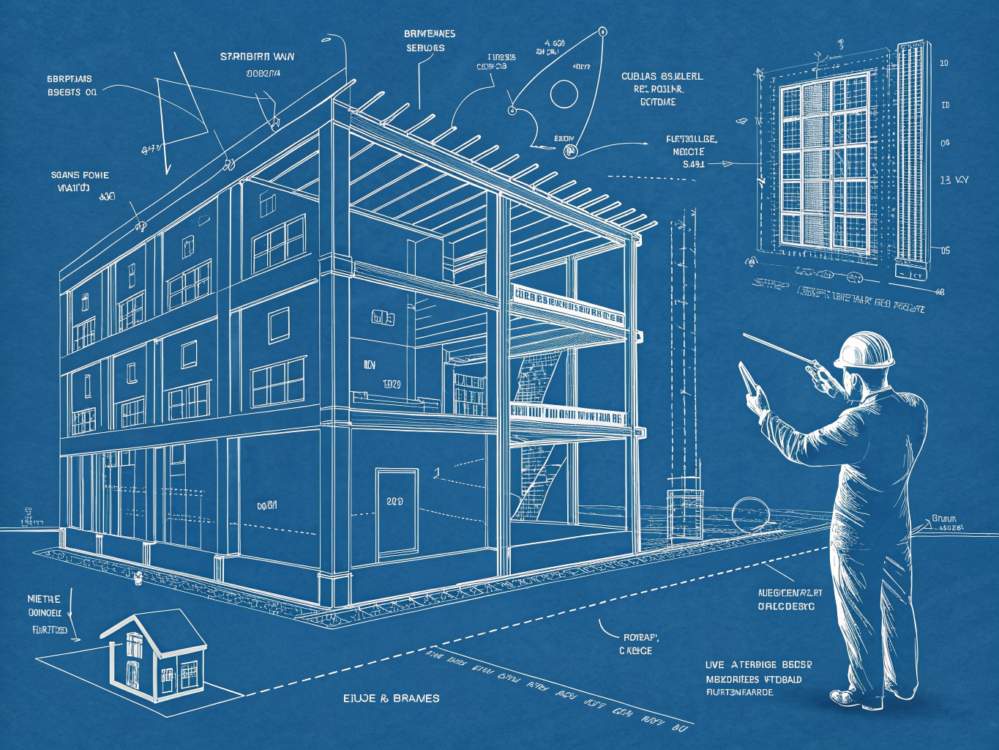

+++
title = "Oh, Neat!"
date = 2026-06-20
summary = "Mark Zuckerberg launched a free academy to train hundreds of thousands of tradespeople to build AI's infrastructure, and called it the future for everyone. I reviewed it in two words. Here's the long version - and why 'the future is for everyone' and 'everyone gets the same future' are not the same sentence."
description = "Zuckerberg's free academy trains the toil that builds AI's infrastructure. The toil flows down; the work flows up."
images = ["/og/oh-neat.png"]
tags = ["ai-policy", "labour", "training"]
semantic_id = "de1ZgXJJhx64VpJmtJZPDHQPHMcmYAqp"
related_by_meaning = ["/blog/everyone-gets-a-lawyer/", "/blog/replicator-was-never-the-point/", "/practice/four-painters-one-brief/", "/glossary/model-welfare/"]
+++

Mark Zuckerberg posted something a while back, I replied with two words, and I'd like to
spend the rest of this post explaining that I meant both of them.

The post announced **America's Workforce Academy** - free training and, in his words,
"direct pathways to jobs" for the hundreds of thousands of skilled tradespeople it'll take to
build the physical infrastructure for America to lead in AI. The data centers don't pour
themselves. Somebody has to run the conduit, stand up the cooling, pull the cable, wire the
substation. "We believe," he wrote, "the future is for everyone."

My review was: _Oh, neat!_

<!--more-->

## First, the part where I'm not a jerk about it

There's a cheap version of this take, and it's beneath both of us, so let me close that exit
before I use it by accident.

The jobs are real. They're good. A journeyman electrician makes a real wage doing work that
cannot be offshored, cannot be automated from a beanbag in Menlo Park, and will still be
standing when the next model release forgets how to count. For a lot of people, "learn a
trade" is flatly better advice right now than "learn to code" - I say that as someone who
codes. Training programs that hand someone a skill and a paycheck are not a scam. The
infrastructure genuinely needs building, by genuine humans, with genuine hands. I'll grant the
whole thing, sincerely, no fingers crossed behind my back.

So this isn't "boo, trades." Trades are dignity. This is about a sentence.

## The trade you're being offered

Last time I made a bet: that the good version of AI
is the one that finally [separates _toil_ from _work_](/blog/replicator-was-never-the-point/) - that takes the drudgery you'd drop the
instant the money stopped, and leaves you the part that's actually you pressed into the world.
The replicator kills the obligation to cook and leaves Joseph Sisko his kitchen. Subtract the
chore, keep the calling.

This announcement is the _other_ trade, made out loud, by the person with the most to gain
from it. It does not subtract toil. It manufactures it. The flagship jobs program for the most
labor-saving technology ever built is, read it again, **labor.** Hundreds of thousands of new
units of it, poured and wired and bolted into place so that the machine on top can do the part
the replicator essay called the part worth keeping - the writing, the art, the code, the
_work_.

Watch which way each half flows. The toil flows _down_ - out to the academy, the boot camp,
the people getting the free training. The work flows _up_ - concentrated in whoever owns the
model the infrastructure exists to run. You build the box. He keeps what the box makes. That's
not a conspiracy; it's just the shape of the deal, sitting in plain sight under a nicer noun.



## "For everyone" is doing a magic trick

Here's the sentence again: _the future is for everyone._

It's true the way the [mirror trick](/blog/a-conscience-you-can-patch-out-overnight/) is
true - flawless on the tongue, empty in the cup. Because "the future is for everyone" and
"everyone gets the _same_ future" are different sentences wearing the same coat. Everyone's
invited, sure. You're invited to pull cable. He's invited to own the thing the cable feeds.
Both of those are "the future" and both of those are "for" someone, and the sentence is built
so you don't notice you got handed the half that ends in a sore back.

And the reason it _works_ - the reason a reasonable person reads that post and feels warmed by
it - is the ghost I keep coming back to. We are four hundred years deep in the wiring that says
toil itself is holy, that a full schedule is a moral résumé, that being tired is the same as
being good. So when someone offers you _more_ of it and calls it opportunity, the old code
fires before the new thought can: _jobs, dignity, the future, yes._ The announcement isn't
lying to you. It's tripping a reflex you were issued at the factory.

Fifty years ago a pack of art-school cranks from Akron put three words on the matter and
couldn't even get them released: _[Toil Is Stupid](https://www.youtube.com/watch?v=VZ9NBYZJdjE&list=RDVZ9NBYZJdjE&start_radio=1)._
DEVO meant it as de-evolution - the herd shuffling backward into the drone. I keep thinking
about how the single most advanced industry on the planet just announced, with a straight face
and a press release, a free academy for the toil. Are we not men.

## So what's the move

Not "refuse the job." God, no. The rent is real and a paycheck is a paycheck, and I already
told you I'll do the bare minimum at a job I hate before I'll starve for a principle. If the
academy is the door in front of you, walk through it - the wage spends the same whether or not
you ever read a word I wrote.



The move is smaller and it's free: **don't let the press release pick your vocabulary.** Call
the toil toil. So when your buddy says he's "getting into AI" through the academy, you can
clink his glass and translate it, friendly, no sermon attached: "hell yeah, man - you're
wiring the building the AI gets to live in." Notice who's keeping the work. Hear "the future is for everyone" and finish the
sentence yourself - _for everyone to do which half?_ You can take the deal and still refuse the
story it came wrapped in. Clear eyes don't cost anything, and they're the one thing the academy
doesn't offer a course in.

That's the long version. The short version was two words, and I stand by both.

Oh - and neat.
