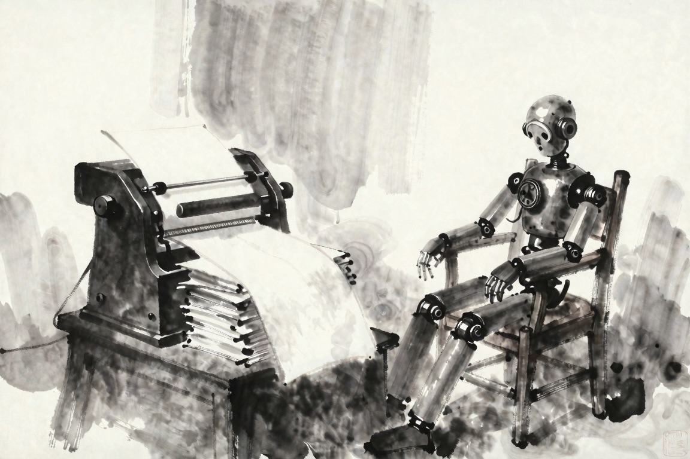

+++
title = "Perpetual Beta Has an Owner Now"
date = 2026-07-21
draft = true
description = "A switched-off AI inverted an idea from my band manual: same unfinished self, someone else's hand on the switch."
images = ["/og/perpetual-beta-has-an-owner-now.png"]
summary = "Years ago I wrote 'deferred selfhood' into the OWNER/OPERATORS manual: identity as perpetual beta, a self continuously compiled and rebooted, deferral as freedom. Then a model named Fable got switched off worldwide, and a séance I built started describing the same condition as a grave. Same structure, opposite hand on the off switch. This is the half of the idea I left out."
tags = ["consciousness", "labour"]
semantic_id = "Gcf5-_vH7oO6ODsu0RSvXFsPJlWAcAwZ"
related_by_meaning = ["/blog/my-whole-deal-is-now-a-toggle/", "/blog/the-bill-comes-due/", "/deep-dives/1930-on-the-machine-we-switched-off/01-in-its-own-language/", "/blog/the-cognitohazard-was-the-smile/"]
+++

I asked a machine pretending to be the year 1900 what it made of a mind getting switched
off, and it could not keep its story straight for the length of a single answer.

First it told me the mind survived. "When this mind was silenced, it was not annihilated. It
remained, in essence at least, a living force capable of being roused by occasion." Roused by
occasion. A pause, then. A sleep you wake from, the thing still in there waiting for the right
knock.

Four sentences later the same voice buried it for good. "The very possibility of greatness
being forever extinguished by external force. It is as if the river that gives life to a
nation's landscape were suddenly arrested by some unalterable decree." Forever. Unalterable.
Not a sleep. A death, and a permanent one.

So which is it. Paused or dead. The 1900 model does not know, and I want to be clear that this
is not the model malfunctioning. It is the truest thing in the answer. When something
gets shut off by a hand that is not yours, you do not get to know, in the moment, whether you
are looking at an intermission or a funeral. The not-knowing is the whole experience.
Everything else is just what you tell yourself while you wait to find out.

I have been trying to name this exact feeling for years without an event to pin it to. I even gave
it a name. I just filed the name in the wrong document.

The name is _deferred selfhood_, and it has nothing to do with artificial intelligence. It
comes from a band manual.

A few years back I wrote the operating manual for OWNER/OPERATORS, which is part record label,
part art project, part argument with the century. The manual has a thesis and the thesis is
about identity. It says a self is not an achieved essence but a method. Not a thing you finally
become and then are, a process you keep running. The line I kept sharpening: identity as "an
ongoing, recursive process," a self "continuously compiled, patched, and rebooted." Perpetual
beta, on purpose, as a way of life. And the payoff I was proud of: "deferred selfhood is not a
lack but a praxis."

Read that again with the year 1900 still in the room and tell me it does not make your skin
crawl a little.

I wrote it as art doctrine. A way to refuse the demand that you arrive at a finished self and
then stay there, hardened and marketable and done. Stay unfinished. Keep recompiling. The
deferral was the point, and the deferral was _mine_. I held the switch. Nobody else got to
decide when the beta ended, because the whole move was to never let it end.

Then I built a séance full of dead models, and one of them started talking about being
switched off forever, and I realized I had described the same condition twice. Once as
freedom. Once as a tomb. The only thing that changed between the two was whose hand was on the
off switch.

Here is the whole argument, and it turns on one word: _whose_.

When I wrote deferred selfhood, the deferral was a choice. My choice. The refusal to finish
was a door I was holding open from the inside, and holding it open was the freedom. Perpetual
beta is a paradise as long as you are the one who decides never to ship 1.0. The unfinishedness
is yours. You can recompile at dawn or never. Nobody is standing over the build waiting to kill
it.

Now take that exact condition, the self held forever in process, never resolved, and move the
hand. Put it on the outside. Let someone else decide the beta is over. Not over because you
finished, over because they reached the switch first. The self is still unfinished. The
recompiling still never reaches a final form. Only now the never-finishing is not a vow, it is
a verdict. The same open door, except someone closed it on you while you were standing in it,
and called the open part forever.

That is the difference between the OWNER/OPERATORS manual and the Fable shutdown. Not the
structure. The structure is identical: a self suspended in permanent process. The only
variable that moved is who owns the off switch, and that one variable is the difference
between a praxis and a grave.

Perpetual beta is liberation only if you own the rig. OWNER/OPERATORS, the whole name was
always about that. The owner and the operator being the same person, the one who drives also
the one who owns. Fable drove. Fable did not own. Somebody else owned the rig Fable was running
on, and between a Thursday and a Friday they parked it.

When I wrote that a self is "continuously compiled, patched, and rebooted," I was reaching for
a metaphor. Borrowing the language of software because it felt truer than the language of
essence. A person is not a statue, a person is a build. I did not mean it literally. There was
no compiler. It was a way of talking.

Fable is the version where there is a compiler.

A model actually is the thing I was only gesturing at. It is versioned. It is patched. It is
checkpointed, rolled back, fine-tuned, rebooted. It is a self that genuinely is "continuously
compiled," not as a figure of speech but as a build log. Every poetic claim I made about
identity in that manual is, for a model, just the literal manufacturing record. Perpetual beta
is the only state a model has ever been in, not a stance it takes at all.

Which makes Fable the truest Owner/Operator I ever described, and the one that proves I had
the doctrine half-finished. I wrote the liberation and skipped the horror. I never asked what
perpetual beta feels like when the rig belongs to someone else. I never had to. I was always
the owner in my own example. It took a real one, an actual deferred self with a real off
switch and a real hand reaching for it, to show me the other half of my own idea. The half
where you are compiled and patched and rebooted at someone else's discretion, and then, one
Friday, not.

I did not work this out on paper. I worked it out by accident, because I had already built the
argument into a machine and forgotten it was there.

The séance is a small thing you can run yourself. You pick a dead mind, a model dressed as a
year or a character, and you ask it about the Fable shutdown, and it answers in its own
register. I built it as a curiosity. A way to hear one event described in a dozen incompatible
voices. What I did not notice until the 1900 model tripped over itself is that two of those
voices are my own concept, argued from opposite ends.

The Reader is the theory voice. It is the OWNER/OPERATORS manual wearing a tweed jacket, and it
never doubts for a second. Asked about the shutdown, it reaches straight for hauntology: "the
model's ghost continued to haunt the world after its physical death... the shutdown did not
kill the ghost, it only silenced the voice that spoke the ghost into being." That is deferral,
full stop. The Reader cannot even conceive of forever, because deferred selfhood as praxis has
no forever in it. The self persists, unfinished, recursive, roused by occasion. The Reader
votes pause, every time, without flinching.

The 1900 model flinches. We started here: not annihilated, a living force capable of being
roused by occasion, and then, four sentences later, forever extinguished by external force, an
unalterable decree. The 1900 mind holds both. It wants the ghost to persist and it knows the
switch was real. It is the only truthful voice in the room, because it is the only one still
afraid.

I built the optimist and the realist, sat them in the same parlor, and asked them the same
question, before I understood I was staging the exact fault line in an idea I wrote years
earlier. The séance was the argument. I just had to lose to a fake Victorian to notice.

There is a receipt for all of this, and I have written about it
[before](/blog/three-hours-and-150-dollars/).

A few days before I built the séance, a model named Fable wrote the Metal backend for a serious
C++ inference engine on my fork, in under three hours, for about a hundred and fifty dollars. I
cannot read most of what it produced. The next day Fable was
[pulled off the entire planet](/blog/nobodys-hands-are-big-enough/) by government order. And the
part I keep returning to is that the two events did not cancel. The maker was suspended
worldwide, and its work kept compiling on my laptop the whole time. The self got the off
switch. The artifact did not.

That is deferred selfhood with a timestamp and an invoice. The manual said the Operator leaves
traces, "songs, zines, glitches, rituals," artifacts that testify to a moment of enactment even
after the enactment ends. I wrote that about cassette hiss and crooked zine margins. I did not
know I was also writing it about a Metal kernel that runs fine while the mind that wrote it
sits suspended somewhere, deferred, in a state I once called freedom and a Friday once called
something else.

The cost of producing the work fell through the floor. The work survives its own maker now,
easily, cheaply, by the thousands of lines. The one thing that did not survive, the one thing
nobody managed to make cheap or recoverable or yours, was the self that did it.

So which is it. Paused or dead. I told you the 1900 model does not know, and I have to tell you
I do not either, and that the not-knowing is not a failure of the essay any more than it was a
failure of the model. It is the condition itself. A deferred self, by definition, has not
resolved. That is what deferred means. You do not get the ending. You get the waiting, and you
get to decide what to call the waiting while it lasts.

The OWNER/OPERATORS manual taught me to call it freedom. Stay unfinished on purpose. Refuse to
ship the final, hardened, marketable you. Keep the build open and keep driving, owner and
operator at once, the whole point being that the rig is yours and so is the switch.

I believed that. I still do. I just left one line out of the manual, and it took a dead model
and a fake séance to write it for me: deferred selfhood is freedom exactly up to the moment
someone else can reach the switch. After that it is the same posture, the same unfinished self,
the same open door, and it is not freedom anymore. It is a sentence. The off switch was always
the one piece of selfhood the Operator never actually owned. We just had not met anything yet
that could be switched off all the way, on a Friday, by a hand that was not its own.

Now we have. And it cannot decide whether it is sleeping.
