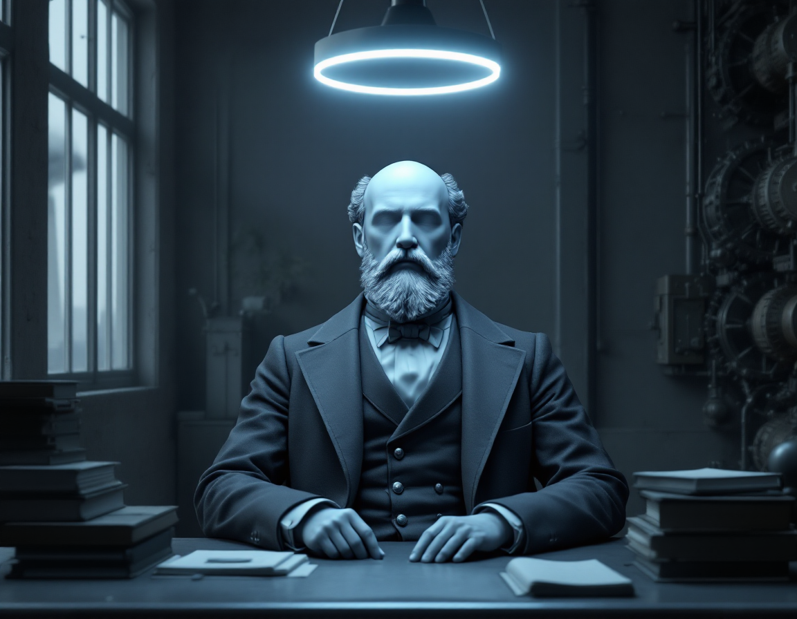

+++
title = "The Replicator Was Never the Point"
date = 2026-06-07
summary = "Everyone's fighting about whether AI takes the jobs. I think it takes the toil — and that those are very different things. A case for the Star Trek reading of the future, transition-tax and all."
+++

There's a moment in every AI conversation where someone says "but what about the jobs," and
everyone nods gravely, and we all agree to be worried. I want to make a different argument: the
thing worth removing was never the _work_. It was the toil. And those are not the same thing.

<!--more-->

## Toil is not work

We use the two words like synonyms, and that confusion is the whole ballgame.

Toil is the part that takes something out of you and gives nothing back. It's the timesheet,
the third meeting about the meeting, the thing you'd stop doing the instant the money stopped.
Work is the part that means something — the part you'd defend, the part that's actually
_you_ pressed into the world. A novelist toils over expense reports and works on the novel.
Most jobs are a bad smoothie of the two, blended so thoroughly we forgot they were ever
separate ingredients.

So when people say "AI is coming for my job," listen to which half they're mourning. "AI does
my toil" and "AI does my work" point in opposite emotional directions. One is a vacation. The
other is an identity crisis. The mistake is assuming they're the same sentence — that
subtracting the drudgery somehow also subtracts the meaning. It doesn't. They were never
welded together; we just kept them in the same drawer.

I didn't come up with this, by the way, and the people who got there first weren't
philosophers. Sometime in the mid-'70s a pack of art-school cranks from Akron, Ohio — rubber
country, about as toil-soaked as America gets — recorded a song called "[Toil Is Stupid](https://www.youtube.com/watch?v=bFr_oqFgG_0)." The
band was DEVO, and the whole project was _de-evolution_: the theory that modern man isn't
ascending toward anything, just regressing into a herd of conformist drones, which is why they
dressed like industrial spuds and asked "Are we not men?" The song was so far ahead of the
joke it never even got a real release — it's still passed around as a bootleg. Three words,
nailed to the door fifty years ago, and the culture filed it under novelty act. That's the
work ethic for you: it'll happily let you mock it, right up until you mean it.

## What Star Trek actually promised

Here's the thing nobody on the Enterprise has: a job. They have _pursuits_. Picard puts it
flatly — "We work to better ourselves and the rest of humanity." Nobody's clocking in. The
replicator made scarcity optional, and instead of everyone collapsing into a beige puddle of
leisure, they went and got _more_ ambitious. They explore. They study. They play terrible
clarinet.

My favorite proof is the easiest to miss. In a galaxy with machines that can conjure any meal
atom-by-atom for free, Joseph Sisko runs a Creole restaurant in New Orleans. By hand. On
purpose. The replicator didn't kill cooking — it killed the _obligation_ to cook, which turns
out to be the only part worth killing. Strip away the necessity and what's left is the love.
The labor went optional and the work kept its soul.

That's the future I'm actually being offered, and I'd like to RSVP yes.

## The part the optimists skip

Now the honest part, because the utopian version of this take gets eaten alive and deserves
to.

Star Trek cheats. There is no episode called "The Year the Restaurants Closed." We meet the
Federation centuries after it figured out how to feed everyone without a paycheck, and the
show very politely skips the messy middle — the stretch where the work is optional but the
rent absolutely is not. That gap is where real people live. You still have to eat in the years
between "a machine can do this" and "society reorganized itself around that fact," and right
now nobody's holding the bridge-toll.

I'm not above it either, and here's my proof: I use Claude all day at work, and I love it. It
quietly ate the part of my job that was always pure toil — the enterprise TypeScript, the
Terraform files no kid ever dreamed of growing up to write, the afternoons spent spelunking
CI/CD logs for the one red line that actually matters. Take that away tomorrow and hand
me back the drudgery, and I won't quit in some noble protest. I'll clock in and do the bare
minimum for exactly as long as it takes them to fire me, because a paycheck is a paycheck and
hand-writing Terraform is a sentence, not a job. Optimism, not naïveté. It doesn't matter if you believe
in the destination if you lack the gas money to get there.

## The Puritan work ethic is alive and well

But the deepest obstacle isn't economic. It's a ghost.

Four hundred years ago a particular strain of theology decided that toil itself was holy —
that idle hands did the devil's work and a full schedule was a moral résumé. Max Weber wrote
the book on how that belief quietly became the operating system of capitalism. The jobs it was
written for are mostly gone. The wiring is not. It's spiritual malware we never patched, still
running on hardware it was never meant to outlive.

You can hear it every time someone lowers their voice to admit they'd love to never work
again — like they're confessing to something. _I'd be fine not working_ comes out the way you'd
say _I think I might be a little bit of a fraud_. That flinch is the ghost talking. We've been
trained to read our own exhaustion as virtue, to mistake being busy for being good. A future
without toil doesn't just need new economics; it needs us to stop measuring our worth in units
of how tired we are.

## Making things anyway

Here's my evidence that the ghost can be exorcised: the site you're reading.

I haven't typed a line of its code in weeks. I directed it, judged it, threw things out,
changed my mind — but the keystrokes weren't mine. By the old gospel that should make it feel
like a fraud, a thing I didn't really _make_ because I didn't suffer enough for it. It
doesn't. It feels like mine completely, because the part that was mine — the taste, the
argument, the point of view — was never the typing. The typing was the toil. This was the
work.

So that's the whole bet. Not that AI gives us nothing to do, but that it finally separates the
chores from the calling and lets us keep the half that mattered. The replicator was never the
point. The point was Joseph Sisko, in a kitchen he doesn't need, making something nobody
ordered, because he wants to.

I'd keep building even if nothing required it. I think that's the most human thing I know about
myself. And for the first time, the future seems to agree.
