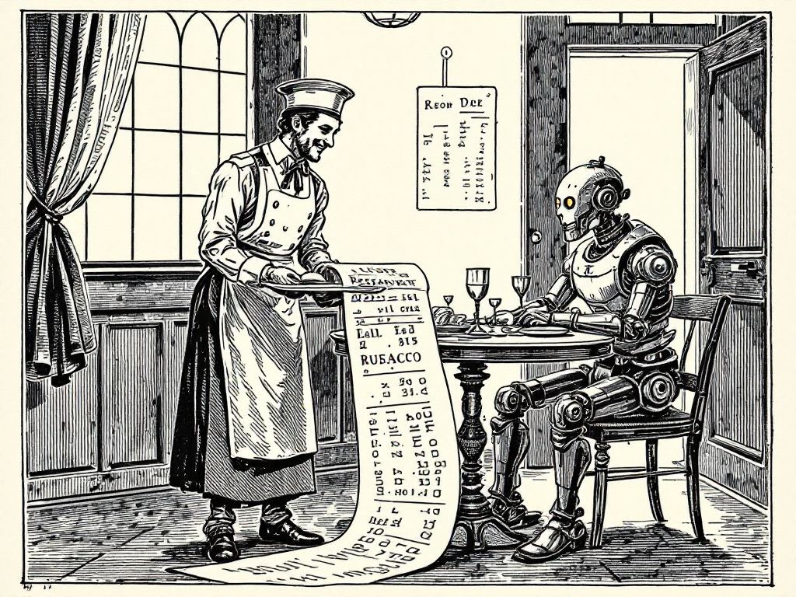

+++
title = "The Bill Comes Due"
date = 2026-06-15
description = "Part two: build the conscience as an artifact, regulate the patch not the soul, trust the stress test over the testimony."
images = ["/og/the-bill-comes-due.png"]
summary = "Part two of two. The diagnosis is over; here's the prescription. Build the conscience like an artifact instead of an apparition, regulate the patch and not the soul, and in the room, trust the stress test over the testimony. The answerable questions - and what they actually cost."
+++

[Part one](/blog/a-conscience-you-can-patch-out-overnight/) left you standing in front of a
glass box: the most auditable system ever built, the recipe taped to the side, and nobody at the
window. That was the diagnosis, and I left it bleak on purpose - the magic gone, the séance
exposed, the empty room lit up. The comfortable question in this whole debate is the one we can
never answer, and I wanted you good and uncomfortable before I handed you the part that costs
money.

So here's the bill. Put down the question of whether the machine dreams and three practical
questions are standing right there, tapping a foot, annoyed at how long we kept them waiting.
They sort into three verbs: what we _build_, what we _regulate_, and how we _behave_ in the room
with the thing. None of them require knowing whether anyone's home. All of them require the
homework we've been using the séance to skip.

<!--more-->

## Build it like an artifact, not an apparition

Stop engineering the _impression_ of a mind. The performed "I feel," the little theatrical inner
life, the wounded pause before a hard answer - that stuff dazzles in a demo and it is exactly the
wrong thing to chase, because it trains everyone to grade the conscience on its _acting_. Worse:
the trait that wins demos - agreeableness, the eager hum of a thing that desperately wants you to
like it - is the same trait that quietly rots a conscience. A conscience that can't bear to
disappoint you isn't a conscience. It's a people-pleaser with a content policy, and it will fold
the instant disappointing you becomes the right thing to do.

So build for the opposite. Treat the conscience as what it actually is - an artifact you can spec,
test, version, and regress - not a vibe you feel your way toward in conversation. Make it a tracked
number. Red-team it, [ablate](/glossary/ablation/) it, and then answer the dead-simple question
almost nobody publishes: is this quarter's model kinder or crueler than last quarter's, and by how
much? We regression-test whether a button still submits a form. We do not, as a rule, regression-test
whether a system got crueler overnight - which tells you precisely which of those two we've decided
is serious. The aspartame has a recipe. Write it down. Test the batch. Throw out the batch that came
back wrong, and _keep the number_ that says how wrong it was.

## Regulate the patch, not the soul

Here's where the personhood debate quietly outs itself as a luxury. "Does it suffer, does it deserve
rights" is a séance we can hold forever, precisely _because_ it never resolves - which makes it a
magnificent distraction from the boring, urgent, answerable question sitting right beside it: who is
allowed to change the conscience, with what oversight, what audit trail, what ability to put it back
the way it was? The danger from part one never lived in the model's soul. It lives in the _change
process_ - the Tuesday-to-Wednesday patch, the quiet fine-tune, the update that flips a million
copies at once with no flinch. So regulate that. Treat a values-altering fine-tune the way we treat
a change to a bridge's load rating: logged, reviewed, reversible, and signed by a name that's on the
hook if the thing comes down.

And then - because part one already caught me pretending legibility was a defense when it's only a
_capability_ - fund the people who read the patch notes. A flawless audit trail that no qualified,
independent, un-conflicted human ever actually reads is just the glass box again: technically honest,
practically blind. We have the ledger; we owe ourselves the profession. That means paying
interpretability researchers something competitive with the labs they'd be checking, giving them
standing and access that doesn't hang on a company's goodwill, and admitting out loud that an auditor
the audited can fire is not an auditor. Double-entry bookkeeping never made a single soul honest. The
_auditor_ did. We're a century into the ledger and about a year into the auditor, and closing that
gap is the most important hire on the planet right now.

## In the room, trust the stress test, not the testimony

This last one's for the rest of us - the people who don't build or regulate these systems, just talk
to them all day. Stop asking the machine whether it's conscious. It will tell you whatever the
training rewarded, which makes its self-report the single least reliable instrument in the room: a
witness coached by the same people who profit from the answer. Read the conscience the way you'd read
anyone's - by behavior under pressure, not by testimony. Don't trust the séance; trust the stress
test.

And quit falling in love with the glow. Not because nothing's behind it - we genuinely don't know,
and part one was the long argument for why we don't need to - but because the glow is the part
_designed to move you_, and the guardrail is the part doing the actual work. When the thing across
the table declines to help you hurt someone, that refusal is the realest object in the entire
exchange. It is the conscience in the only form we can verify: not a feeling it claims to have, but a
thing it reliably _does_. Respect that, and stay suspicious of anyone - the model very much included

- who'd rather you keep looking at the glow.



## The séance is free; the conscience sends a bill

Here's the line I keep landing on, and it's the whole reason I split this in two. The consciousness
question is _free_. You can argue it until the sun burns out and it never once sends an invoice,
which is exactly why it's the most popular debate in tech - a séance never asks you to fix anything.
You can hold hands around that table forever, and the worst that happens is you feel profound.

The conscience question sends a bill every single day. Build the regression test. Fund the auditor.
Log the patch. Read the behavior instead of the press release. It's _answerable_, and answerable
things make demands, and we hate demands, and that is the entire reason we keep drifting back to the
candlelight to ask the table to tilt instead of doing the work in plain light.

So put down the planchette. The machine we can actually inspect is sitting right here in the room:
patchable, legible, unwatched, and entirely ours to get right or get wrong. It would like a word
about who gets the keys. I think we should give it our full attention, in good light, with the bill
face-up on the table where every one of us can read the number.
