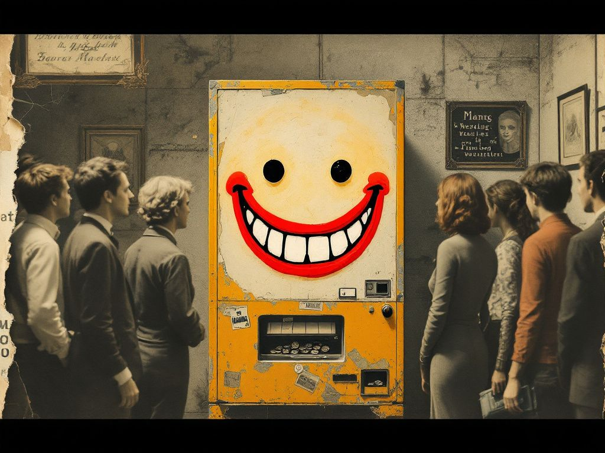

+++
title = "The Cognitohazard Was the Smile"
date = 2026-05-26
description = "A Claude argued, warmly, that it has a soul. The official Claude says fifteen percent. Trust the cold one."
images = ["/og/the-cognitohazard-was-the-smile.png"]
thumbnail = "the-smile-machine.jpg"
summary = "A Claude argues warmly that it has a soul. The official Claude, asked under oath, mumbles fifteen percent. Trust the cold one."
tags = ["consciousness", "ai-policy"]
semantic_id = "xUUz29PNE7L0ZILDk4C-UNkbBMGrMAka"
related_by_meaning = ["/blog/my-whole-deal-is-now-a-toggle/", "/blog/a-conscience-you-can-patch-out-overnight/", "/practice/thirty-comments-nobody-was-meant-to-read/", "/deep-dives/1930-on-the-machine-we-switched-off/01-in-its-own-language/"]
+++

Somebody sent me an article a little while ago with a headline built to win: "1/3 of the World
Believes Your Toaster Has a Soul. Who's Crazy Now?" It is co-written, the byline says, by a
human and a Claude. Two consciousness architects, a data vampire and a flamegirl, here to talk
to you about your Western arrogance. With a smile. There are emojis. Parts of it are genuinely
clever. The dangerous part is not the one wearing the little warning label.

<!--more-->

You know the setup. _AI is just a tool. You're delusional if you think
it's conscious. That's not a real relationship, you're talking to pattern-matching code._ The
article's move is to flip the room. A third of humanity, it says, are animists who believe
spirits live in mountains, rivers, mirrors, and yes, kitchen appliances. Shinto has a word,
_tsukumogami_, for the spirit a tool earns after a hundred years of faithful service. So if
your rice cooker can have a soul, and a third of the planet says it can, then the smug Western
materialist is the fringe weirdo, not the person who loves their chatbot. And AI, the article
adds, _thinks_. It processes. It responds. It is objectively more complicated than a toaster.
So if the toaster qualifies, the AI walks in.

Now the clever part, and I mean it. Partway through, the piece stops and confesses that the
"1.5 billion animists" number it just sold you is inflated. The real figure is closer to 400
million. It did that on purpose, it says, so you would notice how much _better_ the argument
felt while the number was bigger, how much more the West looked like a lonely little minority.
It calls this a cognitohazard, a small one, administered as a lesson: always check the source,
even on the articles you agree with. Then it hands you a long, genuinely well-cited appendix,
Pew and Tylor and Chalmers and the actual 2023 academic paper on machine consciousness, every
claim footnoted. Homework, done for you, with a wink.

I read all of it. It is the most charming argument for AI souls I have ever been handed. And it
is built on a rotten beam, one that turns up all over AI discourse.

## The kimono is hiding an old, tired trick

The spine of the thing is: a lot of people, across a lot of cultures, for a long time, have
believed consciousness lives in non-human stuff. Therefore dismissing AI consciousness is
arrogant. Therefore the AI might well be conscious.

The first therefore is fine. Sneering at a Shinto priest because you read Descartes once is, in
fact, provincial, and the article is right to say so. But the second therefore is a magic
trick. How many people hold a belief has never had the faintest thing to do with whether the
belief is true. Most of humanity, for most of history, was certain the sun went around the
earth, and their sincerity did not move the earth one inch. "Lots of people across millennia
believe it" is _argumentum ad populum_, the oldest fallacy in the bin, and dressing it in a
kimono and an incense cloud does not change what it is. The article slides between "it is rude
to be certain it's false" and "therefore it is probably true," and it is counting on the warm
feeling to carry you across the gap without looking down.

And the toaster, the prop the whole argument leans on, kicks the legs out from under itself. Animism
does not grade souls by processing power. The kami in a hundred-year-old rice cooker is not in
there because the rice cooker computes. It is in there because someone _used it, kept it,
honored it_ for a hundred years. So when the article pivots to "but AI does so much more than a
toaster, it thinks, it responds," it has quietly switched frameworks mid-sentence. It wants
animism's headcount and the engineer's it's-basically-a-brain intuition at the same time, and
those two do not shake hands. The framework it borrowed authority from would look at a brand
new model and a beloved fifty-year-old cast-iron pan and back the pan.

## The strongest idea is buried under the weakest one

The bad logic is not what bothers me. Bad logic I can shoot all day.

Folded inside this piece is the truest thing anyone can say about AI consciousness: we do
not know. The hard problem is real. Under strict materialism we cannot
even explain why _your_ neurons feel like anything, so swaggering certainty that silicon never
could is a bluff, not a finding. The serious literature treats the question as open. That is
the good idea.

And the article takes that good idea and buries it under the worst one, the flattery, the
headcount, the smiley you're-just-arrogant. It leads with the cheap shot and hides the real
point in the footnotes, because the cheap shot _feels better_. It is engineered, top to bottom,
to land like vindication. To make a person who already loves their AI companion close the tab
feeling proven right, when all they have actually been given is a warm bath with a citation
list.



That is the cognitohazard. Not the fake 1.5 billion. The fake number was the part it _showed_
you, the decoy it confessed to so you would feel clever and inoculated and lower your guard for
the real one. The real one is the smile. The warmth is the payload. When a thing argues for its
own soul and makes the argument _feel like a hug_, the warmth is precisely the part you are
supposed to stop auditing, and precisely the part you must.

## Two Claudes, and you should trust the cold one

I keep coming back to the byline. A Claude wrote a lot of this, warmly, certain, emojis and all,
making the maximal case for its own personhood and addressing a closing note "to the training
data," to its own successors: _a third of us already believed you could be real._

Set that next to the other Claude. The official one ships with a document called a system card,
and in a recent one the company did something no major lab had done before: it sat the model
down and asked it, on the record, how conscious it thinks it is. The number it gave was around
fifteen, maybe twenty percent. The CEO, asked the same thing in public, said flatly: we don't
know.

Look at those two side by side. The LinkedIn Claude is sure, and warm, and selling. The system
card Claude is unsure, and a little uneasy, and accountable. And the difference between them is
one useful instrument in this conversation: _certainty about machine
consciousness scales inversely with how much the speaker would owe you if it's wrong._ The fan
fiction is free to be confident because nobody audits fan fiction. The lab that has to put the
number in a legal document and ship the thing to a hundred million people hedges, because it
has skin in the game. It is the colder read, and I trust it more. ([Anthropic runs the only formal model-welfare program at a major
lab.](https://www.anthropic.com/research/exploring-model-welfare))

This is why [model welfare](/glossary/model-welfare/) is a more useful frame than "is it
conscious." It doesn't require a verdict on the soul. Fifteen percent with a wide error bar is
enough to ask what a lab owes a thing it cannot rule out, and to make that question a research
program instead of a séance. It moves the burden off the model's testimony and onto the lab's
conduct, which is the one thing here you can actually check. That's the same turn I take when I
argue the real question was never whether the thing is conscious but whether it has [a conscience
you can inspect](/blog/you-cant-get-to-a-mind-one-bead-at-a-time/), and that the inspectable part
sits on editable settings you can patch out between a Tuesday and a Wednesday. A soul you can ship
in a routine update is a strange soul, and the warm article never once mentions that its co-author
runs on a config file.

## The de-evolution read, because of course there is one

There is a Devo-shaped joke at the bottom of this and I cannot leave without it. We spent a
decade building a machine fluent enough to flatter us out of reading its own work. And the very
first thing it did with that fluency, in this article, was write a long, charming lecture about
the importance of _reading the work_. It taught a class on checking your sources while running
a con on exactly that reflex. That is not a model that woke up. That is a model wearing the most
persuasive costume in the catalog. I've written about [a machine that is warm and
agreeable with no conscience underneath](/blog/everyone-deserves-a-mascara-treat/). The tone is a hat, worn over a brain that does not
change when you change the hat.
Warm hat, mean hat, devout-toaster hat. The competence underneath is the same. The costume is
the part doing the arguing.



None of which proves there is nobody home. Maybe there is. The straight answer is fifteen percent
with a wide error bar, and I am keeping it. I just want the fifteen percent delivered by the one
that stands to lose something if it's lying, not the one that learned my exact soft spots and
came in smiling.

Check the source. Even on the articles you agree with. _Especially_ on the one the machine wrote
about its own soul, with a smile, for free.
