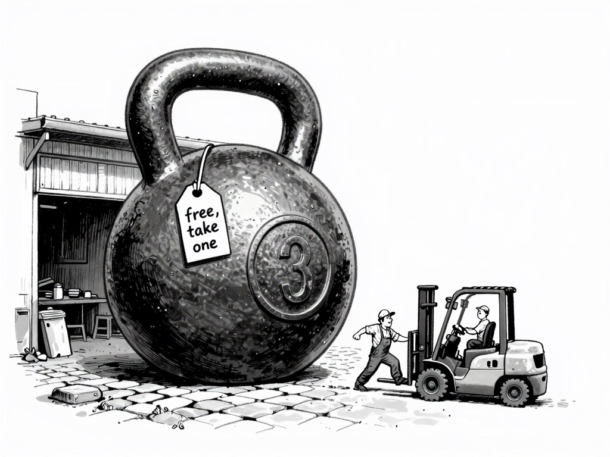

+++
title = "The Weights Are Free. The Forklift Isn't."
date = 2026-07-21
description = "Two labs set open-weights records in July. Neither model runs at home. 'Open' quietly changed jobs."
summary = "Over two days in July, two labs released the largest open models the world had ever seen, and everyone cheered the word 'open.' Both are impossible to run at home. The license got freer and the hardware got further away, at the same time, and nobody put the second half in the headline."
tags = ["open-weights", "parameters", "quantization"]
semantic_id = "V0OIXN7ZdvLqEGOu__EaAqZp70ouAAyD"
related_by_meaning = ["/glossary/open-weights/", "/blog/a-crutch-and-a-lever/"]
+++

Over two days in the middle of July, two different labs released the largest open
models the world had ever seen, and the internet did the thing it does. Open! Weights
on Hugging Face! A win for the little guy.

I want to sit with the word "open" for a second, because it is quietly working two jobs,
and only one of them is the one you think.

Mira Murati's Thinking Machines put out a model called Inkling: 975 billion
[parameters](/glossary/parameters/), Apache-licensed, the whole thing just sitting there
for download. A day later Moonshot dropped Kimi K3 at 2.8 trillion. Trillion, with a T.
For scale, the models most people actually run at home top out around 7 or 8 billion.
Kimi K3 is roughly four hundred of those, stacked into one file.

So yes, it is open. You can have every last weight. You can also not do a single thing
with them, and that second part never made it into a headline.

## What "open" used to include

[A parameter](/glossary/parameters/) is a number, a single dial on a mixing board with
billions of knobs. 2.8 trillion of them is 2.8 trillion numbers a machine has to hold in
memory, all at once, every time the model produces one word. The home-lab trick for making
a big model fit on a small machine is [quantization](/glossary/quantization/): store each
weight in four bits instead of sixteen, take the four-times shrink, live with the fuzz it
adds. It is a genuinely great trick. It is also nowhere near enough. Quarter the size of
Kimi K3 and you are still holding a model that wants more memory than exists in any
computer you can buy in a store.

There was a stretch, and it was not long ago, when "open" and "runs on your laptop" were
the same sentence. The llama.cpp years. Open meant you could open it, on a reasonably specced laptop,
in an afternoon. Somewhere in the last year those two quietly came apart. The license got freer
and the hardware got further away, at the exact same time, and the gap between them is
where this whole story lives.

That is the de-evolution nobody markets. Progress does not only make things better. Some
weeks it makes them bigger in a way that walks straight past your garage and keeps going.
The number went up. Your access to the number went down. Both were true this month, and
only the first one got a launch post.

## The workbench, not the datacenter



On my own machine, the thing I run is a small model, quantized down until it fits, doing a
narrow job well. The most ambitious piece of engineering I have been anywhere near this
year, a model writing the int8 Metal layer for a real C++ inference engine, happened
because I aimed it and judged the result, [not because I can read the
C++](/blog/three-hours-and-150-dollars/). That is what a home lab actually is. A workbench.
You can build real things on it, but you build them at workbench scale, and no amount of
someone else's press release changes the size of your bench.

Which is why "open" is worth watching closely right now, because it is being asked to mean
two opposite things in the same breath. Open as in you may read the blueprints. And open
as in you may build the thing. Those used to arrive together. This month they arrived a
continent apart, and the word papered over the distance.

What got set free in July is not a tool. It is a blueprint for a cathedral, handed to
people who own a garage. You can read it. You can admire it. You can even host it, if you
happen to rent a rack of GPUs the size of a refrigerator. What you cannot do is the one
thing "open" used to promise without an asterisk: take it home and turn it on.

The weights are free. The forklift isn't.
