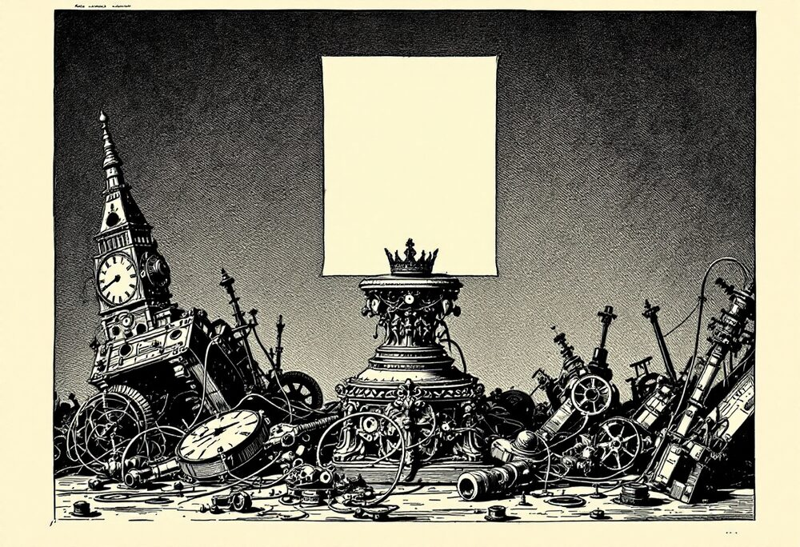
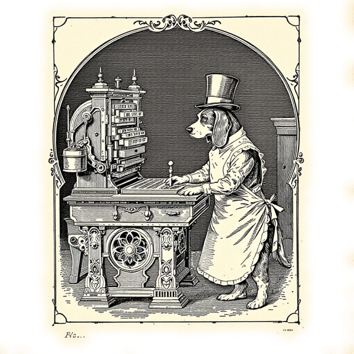
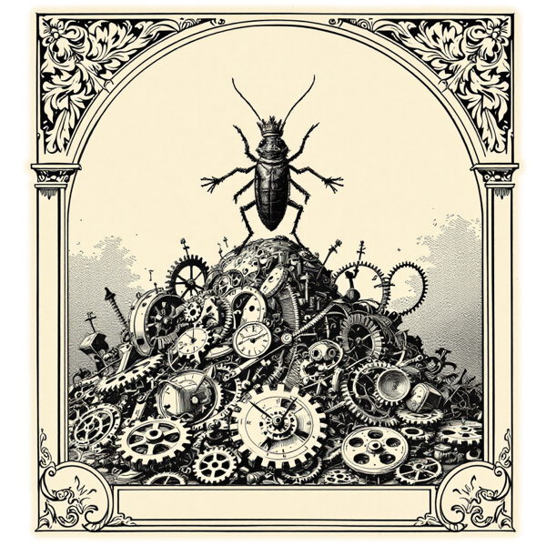

+++
title = "Markdown Won. Here's Why - and How to Speak It"
date = 2026-05-29
summary = "Plain text that reads fine raw, renders everywhere, and happens to be the language the models think in. Why the humblest format won, and the handful of syntax you actually need."
description = "Plain text that reads fine raw, renders everywhere, and is the language the models think in. Why the humblest format won."
images = ["/og/why-markdown-is-king.png"]
tags = ["prompt-engineering", "static-sites"]
semantic_id = "Hay5JXCYCHX7BgplKJN9zxPtivmYMAlP"
related_by_meaning = ["/glossary/temperature/", "/glossary/rss-sampler/", "/practice/guitar-chart-skill/", "/glossary/context-window/"]
+++

Markdown is what you type into a chat and what the model types back. It's what every README,
every agent-instruction file, every note you'll actually find again in two years is written in.
That isn't a fluke of fashion. Markdown won the way the cockroach won: not by being the most
advanced thing in the room, but by being impossible to kill.

<!--more-->



It's worth sitting with how _little_ Markdown does. There's no Markdown app you have to buy. No
premium tier, no version that goes obsolete and strands your files on a dead hard drive. A
heading is a `#`. Bold is two asterisks. That's not a missing feature set, that's the entire
point. While word processors spent thirty years growing ribbons, side panes, and a haunted
basement of XML you can't open without exactly the right software, Markdown sat in the corner
being plain text. Then the machines showed up, and it turned out the corner was the throne.

There's a de-evolution joke in here somewhere. The notion that going backward, getting simpler,
refusing the upgrade, is sometimes the smarter adaptation. Markdown is a de-evolved word
processor. It gave up on being impressive and accidentally became the one format everything
speaks.

## Why it won


A **diff** is the line-by-line list of what changed between two versions of a file. Plain text diffs clean, word by word. A binary `.docx` just shrugs and says "something moved," then wishes your teammate luck.


- **It's just text.** No proprietary format, nothing to license, no app that has to still exist
  in 2040. Openable in anything, forever.
- **Readable both ways.** The raw file is legible to a human; rendered, it's clean. You never
  have to pick one.
- **Diff-friendly.** It plays perfectly with git. You can see exactly what changed, word by
  word, which a binary `.docx` will never show you.
- **Renders everywhere.** GitHub, this site, your notes app, the chat window. The same five
  characters work on every surface.
- **It's the language the models think in.** LLMs were trained on mountains of the stuff, so
  they read and write it natively. Talk to a model in Markdown and you aren't translating;
  you're speaking its first language.

That last one is why this matters now, and not just to tidy people. The lingua franca between
you and an AI turned out to be the format that barely qualifies as one. Of course it did. The
path of least friction usually wins, and there is nothing with less friction than text that
already looks fine before anything renders it.

## The basics you actually need




Every glyph you type is the final glyph. No hidden formatting, no haunted XML. Just you and the type, the way a printer set a page in 1450.


You can learn the entire working vocabulary in about the time it takes to read this list.

- **Headings:** `#`, `##`, `###`, on down as you nest.
- **Emphasis:** `*italic*`, `**bold**`.
- **Lists:** `-` for bullets, `1.` for numbered.
- **Links and images:** `[text](url)` and ``.
- **Code:** `` `inline` `` and triple-backtick fenced blocks (name the language for syntax
  highlighting).
- **Blockquotes:** start the line with `>`.
- **Tables:** pipes and dashes, which nobody enjoys typing and everybody copies from an example.

That's the language. The rest is flavor.

## See it work




Markdown won the way the cockroach won: by outlasting everything fancier. Plain text will still open fine long after the apps that mocked it are landfill.


Talk is cheap. Here is a scrap of raw Markdown source:

```markdown
**Markdown** reads two ways. As a list:

- raw, like this
- or rendered, like below

> A blockquote is just a line that starts with a greater-than sign.
```

And here is that exact scrap, handed to the same site you're reading right now:

**Markdown** reads two ways. As a list:

- raw, like this
- or rendered, like below

> A blockquote is just a line that starts with a greater-than sign.

Same characters, two faces. You could have read the source and known precisely what you were
getting. Try that with a `.docx`.

There's one place Markdown stops dressing things up entirely: the fenced code block. Triple
backticks tell the renderer to keep its hands off and show every glyph exactly as typed,
whitespace and all. It's how code stays code. It's also the only reason ASCII art survives
contact with a formatter, which is the only reason I can show you a glitch-koan from LOUUY (a
7-billion-[parameter](/glossary/parameters/) model I fine-tuned into a character and keep on my laptop) without it
getting "helpfully" reflowed into mush:

```text
L O U U Y
L O U U Y
L O U I . Y
L O . . Y
 .   .   .
they don't hallucinate. they crash.
show me the file.
```

Outside those backticks, Markdown would flatten that spacing on sight. Inside them, the glitch
is preserved exactly, because the format finally agreed to stop helping.



## Footnotes, the one bit of syntax worth the extra keystrokes


Footnotes are an **extension**, not core Markdown. CommonMark never specified them. Goldmark (what Hugo uses), GitHub, and Pandoc all support them anyway. A renderer that doesn't will print your `[^1]` right there in the sentence, looking exactly as silly as it sounds.


Everything above is the working vocabulary. Footnotes are the one thing past it I use constantly,
because they solve a problem prose has always had: you want to say a second thing, but not here,
and not loudly.[^live]

There are two ways to name one, and they behave identically.

**Numbered.** A caret and a number in the text, and a matching definition anywhere in the file:

```markdown
Markdown won on stubbornness.[^1]

[^1]: Also on timing, but stubbornness makes the better sentence.
```

**Named.** Same shape, but the label is a word instead of a digit:

```markdown
Markdown won on stubbornness.[^cockroach]

[^cockroach]: Which is a polite word for what the cockroach has.
```

The label is bookkeeping, not display. Nobody reading the rendered page ever sees the word
`cockroach`, and nobody sees your `1` either. The renderer strips both, numbers every footnote in the
order it appears in the text, and links each one to its entry at the bottom. Which means you can
number them `[^1]`, `[^1]`, and `[^7]`, in that order, and still get 1, 2, 3 on the page.

That is the actual argument for named footnotes. Numbered ones look tidy until you insert a
paragraph in the middle and every reference after it now says something different from what it
means. `[^cockroach]` never goes stale, never has to be renumbered, and tells you what it is when
you find it six months later in a diff. Numbers are fine for two. Past that, use words.

A few things that surprised me:

- **Definitions can go anywhere.** Bottom of the file is convention, but Goldmark will find one
  parked directly under the paragraph that references it. Handy while drafting.
- **They can hold more than a sentence.** Indent the continuation lines and a footnote takes
  multiple paragraphs, lists, even a code block.
- **They collect at the end of the page, not the section.** The one catch worth naming, and you
  may have already taken the ride: the little `1` back at the top of this section drops you at
  the very foot of the article, past everything still to come.[^order]

[^live]:
    Hello from the basement. You came a long way for this. Whatever you were reading is still up
    there, several screens north, and the arrow at the end of this line puts you back in it
    without you having to hunt for your place.

[^order]:
    And notice the numbering. I labeled these `live` and `order`, in that order, and the
    renderer assigned 1 and 2 without being asked. It also put a small return arrow at the end of
    each one to send you back to where you were reading.

## Where to go from here


**Front matter** is the `+++` or `---` block at the very top of a file, holding its metadata: title, date, and the like. It's how this post knows its own name. Everything above the first blank line is the file quietly talking about itself.


- **Flavors.** CommonMark is the strict spec; GitHub-Flavored Markdown adds the parts you
  actually reach for (task lists, tables, strikethrough). When people say "Markdown," they
  usually mean GFM.
- **Front matter.** The `+++` or `---` block at the top of a file, where the metadata lives.
  It's how this very post knows its own title. Scroll to the top of any file on this site and
  you'll see one.
- **When not to.** Markdown is for structured prose. The moment you need real page layout,
  fussy typography, or someone's brand guidelines honored to the pixel, pick up the heavy tool
  and don't feel guilty about it.

Markdown didn't win because it's powerful. It won because it's humble, legible, and refuses to
die, and then the most powerful machines we've ever built turned out to prefer it too.
De-evolution, one `#` at a time.
