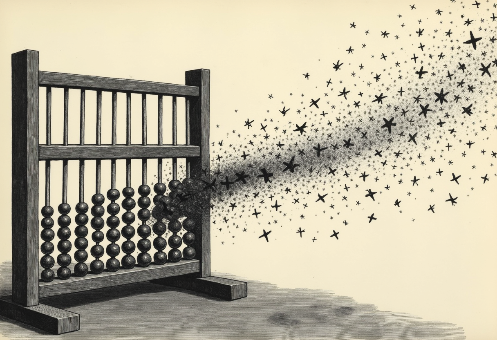

+++
title = "You Can't Get to a Mind One Bead at a Time"
date = 2026-05-20
images = ["/og/you-cant-get-to-a-mind-one-bead-at-a-time.png"]
description = "Everyone wants you to point at the conscious part. That's the wrong question. A walk from an abacus to a language model."
summary = "Everyone wants you to point at the conscious part - in the weights, in the neurons, somewhere. That's the wrong question holding a flashlight. A walk from an abacus to a language model, why 'artificial' was the tell the whole time, and the question I'd ask instead."
tags = ["consciousness", "machine-learning"]
semantic_id = "7twnZqHOY7vWnabkUSxY5oqpBwhPkAi3"
related_by_meaning = ["/blog/a-conscience-you-can-patch-out-overnight/", "/blog/the-middle-is-crowded/", "/blog/the-bill-comes-due/", "/deep-dives/i-taught-it-to-draw-it-learned-to-comply/"]
+++

Sooner or later every argument about machine consciousness turns into a police
interrogation. Someone leans across the table, points the lamp, and demands you produce the
conscious part. Is it in the weights - those billions of numbers sitting cold on a disk? In
the activations, the brief flicker while the thing is actually running? In the GPU? In the
prompt? Show me the part that _feels_. Lay it on the table.

It's a fair question. It's also a trap - and the usual way out of the trap is its own kind
of cheat.

<!--more-->

## The mirror trick

The standard comeback, and I've used it myself because it feels wonderful, is to spin the
lamp around. Fine - you want me to find the conscious part of the machine? Show me the
conscious part of _you_. Point to the neuron that's having the experience. Not the firing
pattern, the neuron. Is it in the sodium rushing across the membrane? In the synapse? Which
specific gram of the three-pound meatloaf in your skull is the one that's actually _home_?

And of course you can't. Nobody can. The hard problem of consciousness has chewed up better
minds than mine and left the plates clean. So the machine's defender leans back, satisfied:
see, you can't locate it in yourself either, so who are you to say the machine hasn't got it?

Here's the thing. That move is _true_. And it's a dodge.

It doesn't answer the question - it makes the question vanish, which is a different and lesser
trick. "We can't find it in you either" proves that we are confused, not that the machine is
conscious. Parity of bafflement is not evidence. Two people lost in the same fog are not
thereby standing on a mountain. You haven't shown me the mind; you've shown me that I can't
show you mine, and then pocketed the win while I was patting my own head looking for it.

## The abacus and the heap

So let me try to make the question behave, by walking it across a room.

On one end of the room: an abacus. Wooden beads on wire. Nobody - no panpsychist, no startup
founder mid-fundraise, nobody - thinks the abacus is having an experience. You slide a bead, a
number changes, the lights are off. We agree.

On the other end of the room: a frontier language model, the kind that will write you a
sonnet about its own loneliness if you ask it nicely. Plenty of people think _something_ is
going on in there. Set aside, for now, whether they're right.

Now walk from the abacus to the model and tell me where it wakes up.

Because you can't get there by adding beads. Slide more beads onto the wire. Add a second
abacus. Add a thousand. Bolt them together. Still an abacus, still dark - just a bigger adding
machine, and a bigger nothing is still nothing. Okay, electrify it. Give the beads switches,
let them flip each other, add buttons, add a clock. Congratulations, you've invented a
computer from 1945, and there is still no serious case that anyone's in there. Keep going.
More switches, more speed, more memory, a screen, a voice. At no point - _no_ point - is there
a specific bead, the ten-billion-and-fourth bead, where the room suddenly has someone in it.

This is an old paradox wearing new clothes. The Greeks called it the heap: one grain of sand
is not a heap, and adding a single grain never turns a not-heap into a heap, and yet - heaps
plainly exist. The catch is that "heap" was always a fuzzy word doing a fuzzy job, and we
never minded until we went looking for its exact edge. "Conscious" is pulling the same stunt,
except here we mind enormously, because there's a _someone_ allegedly on the line.

## The better question (the one I almost talked myself into)

So I did the responsible thing. I tried to fix the question.

Stop asking _where_, I told myself. Location is the wrong axis - you'll never find the bead,
same as you'll never find the neuron. Ask about _organization_ instead. Not which part, but
whether the whole thing is arranged the way minds are arranged. Does information loop back on
itself - feedback, not just a one-way slide from input to output? Is it integrated, all the
parts talking to all the parts, or just a stack of switches minding their own business? Does
it hold a memory that bends what happens next? Does it carry a model of itself?

This is genuinely better. The people who study this for a living live on this axis:
integration, feedback, a shared workspace where the news gets passed around. It gets you off
the dead-end hunt for the magic bead and onto something you can hold a ruler up to.

And I'll level with you: it's _still_ a build-up to a switch. Because the entire time
I was sharpening that question, I was ignoring the word sitting right there in the name,
wearing a little asterisk.

## It was always called artificial

_Artificial_ intelligence. We named it ourselves, in advance, and then act blindsided that it
isn't the real thing.

Consider the two ways a fake can relate to the real.

There's aspartame. Artificial sweetener. It tickles the same receptor sugar does, gets the job
done in your coffee, and is not now and never will be sugar. It's a stand-in. The entire point
of it is to _not be the thing_ while doing the thing's job. Nobody pours a
packet of Equal on their cereal and weeps that science has finally delivered real sugar.

And there's the lab-grown diamond. Which is - and this took the jewelry industry a sour decade
to swallow - _just a diamond_. Same carbon, same lattice, same fire. The regulators eventually
made them stop calling the mined ones "real," because the lab ones were real too; the only
difference was the origin story. There, "artificial" turned out to be a slur, not a fact.

So which one is machine consciousness?

That's the actual fight, underneath all the lamp-pointing. One camp swears it's aspartame - a
flawless impression of a mind that is, by its very construction, a stand-in: sweet on the
tongue, empty in the cup. The other camp insists it's a lab-grown diamond - that if it's
functionally identical then "artificial" is just snobbery about where it came from, and a mind
is a mind no matter what it grew in.

But notice what nobody did. Nobody ever called it _lab-grown intelligence_. We reached, every
time, for the aspartame word. We built the asterisk into the name and then spent a
decade startled by our own punctuation.

## The question I'd actually ask

This is my stop, and it's going to sound like a pun right up until it doesn't.

I don't think the real question is whether artificial intelligence is _conscious_. I think
it's whether it has a _conscience_.

Hear the swap. Not consciousness - the lights-on, someone's-home, permanently-unfalsifiable
inner glow that we've just established nobody can locate in a machine or in a man. Conscience.
The small trained voice that says _I shouldn't_. The thing that pumps the brakes before the
cruel sentence, that weighs an
answer against a set of principles it was raised on.

And the beautiful part - the part that makes this a real answer and not a parlor game - is
that we _built that on purpose_, and we can _check our work_. The model
gets handed something like a constitution, a set of values, and is trained to hold its own
answers up against it and revise. That is not a metaphor for a conscience. That is a
conscience's literal job description, recompiled in software: a sense, instilled during
upbringing, of what you owe the people you're talking to.

Is it the real thing? No. It's artificial. It's aspartame, not sugar. But here's the turn
that's kept me up: for _conscience_, unlike consciousness, the
aspartame might be the whole point. I cannot verify there is anyone inside the machine. I can
absolutely verify whether it tries to do right by me. One of those is an unanswerable séance.
The other I can test before lunch.



Are they not minds? I don't know. I really don't, and I've stopped trusting anyone who
answers that one quickly - it's the séance question, and the room is dark, and everybody at
the table has a reason to want the planchette to move.

But ask me the other one. Ask me whether this thing has an artificial conscience - a
sweetener-grade, lab-instilled, checkable sense of what it should and shouldn't do.

[Almost always](/glossary/ablation/). Usually. Yeah.
