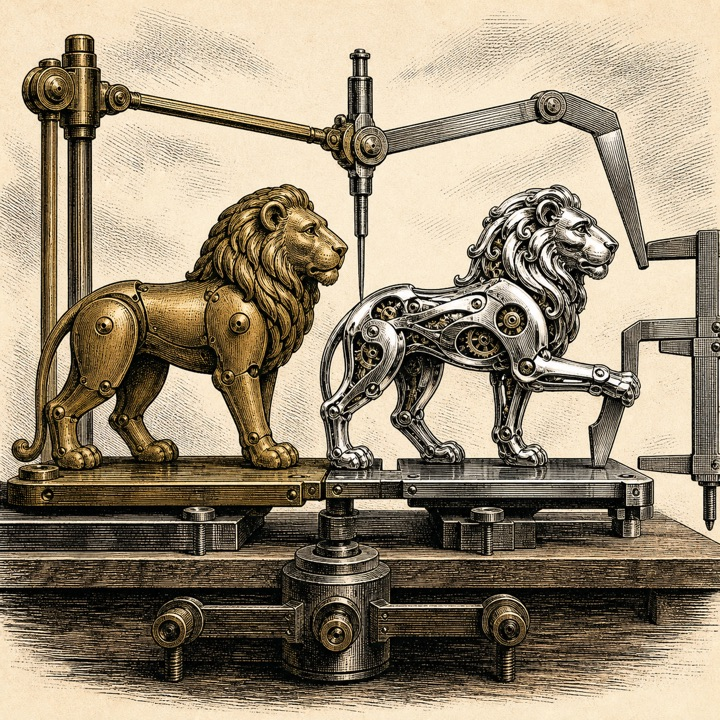
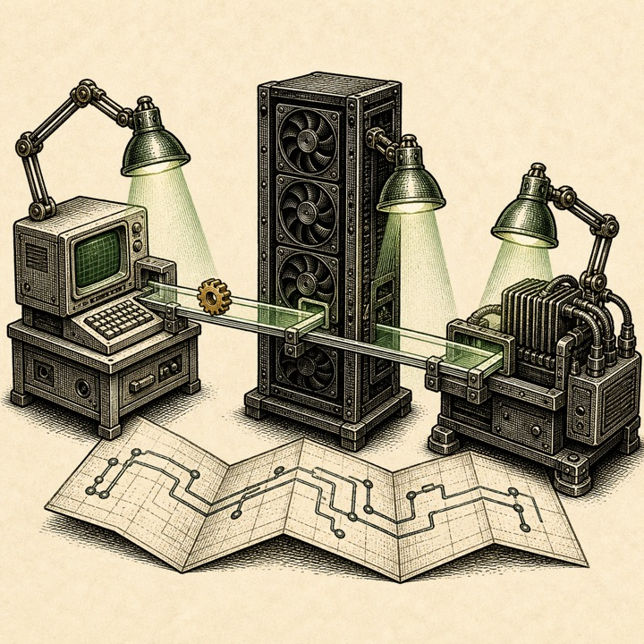

+++
title = "I Went Looking for Metal and Found a Broken Lion"
date = 2026-09-01
description = "An Apple Silicon backend fork found a Lion optimizer bug that crossed CUDA, Triton, and MPS, then crossed back upstream."
images = ["/og/looking-for-metal-found-a-broken-lion.png"]
summary = "I forked bitsandbytes to build an AI-assisted native Metal backend for Apple Silicon. The backend stayed in the fork. The first correctness test found a Lion optimizer bug in three existing backends, and that smaller finding made it upstream. This is the useful shape of AI-assisted open-source work: build the ambitious thing in public, then separate the part you can prove, test, and hand to a maintainer without handing them your whole experiment."
tags = ["apple-silicon", "bitsandbytes", "metal", "mps", "quantization"]
semantic_id = "-XX7ntsevV9m2aBEXWR1LY4lVNKM8A9Y"
related_by_meaning = ["/glossary/metal/", "/deep-dives/ctranslate2-metal-backend/07-not-a-pull-request/", "/deep-dives/porting-ml-to-apple-silicon/", "/deep-dives/ctranslate2-metal-backend/03-msl-indignities/"]
+++

I forked [bitsandbytes](https://github.com/bitsandbytes-foundation/bitsandbytes) to give it a
native Metal backend for Apple Silicon: hand-written quantization kernels, fused 4-bit
matrix-vector math, an Apple matrix-multiplication path, shader packaging, and a parity suite
large enough to need its own furniture.

That is not the part that went upstream.

The part that went upstream was a Lion.



More precisely, it was a weight-decay bug in the Lion optimizer, found by the first test I
required before an agent could write a Metal kernel. The Apple backend stayed in
[my fork](https://github.com/eaglstun/bitsandbytes). The bug crossed back into the main project,
first through [pull request #1993](https://github.com/bitsandbytes-foundation/bitsandbytes/pull/1993)
and then through a [Triton follow-up](https://github.com/bitsandbytes-foundation/bitsandbytes/pull/2001).

I like that better than the clean story where the shiny backend sails upstream whole. It says
something useful about the difference between making a lot of code and making one claim somebody
else can afford to trust.

<!--more-->

## What bitsandbytes does, in the least romantic terms possible

Large models are mostly arrays of numbers in 16- or 32-bit containers.
[bitsandbytes](https://huggingface.co/docs/bitsandbytes/main/en/index) keeps much of that machinery
in 8 or 4 bits so inference and training use less memory.

For years the name was nearly a synonym for CUDA. The project has since grown CPU, Intel, AMD,
Gaudi, and partial Apple support, but the code still carries the geology of the hardware it grew
up around.

My fork started with a narrow question: what would it take to make the useful 4-bit path run
through real Metal kernels on an Apple GPU, rather than simply composing ordinary PyTorch ops?

The first phases added roughly 3,700 lines: almost a thousand of parity tests and more than a
thousand of plans and notes. A healthy ratio for an experiment involving GPU pointers.

The code was AI-authored. I set the scope, supplied the Apple-Silicon references, required the
gates, and judged the behavior. Claude Opus 4.8 planned and wrote it, with co-authorship disclosed
in the commits and pull requests. I can tell when the house is crooked and send the crew back
with measurements. I will not pretend I laid the bricks.

## The first instruction was: do not write Metal

The obvious first move in a Metal backend is a Metal kernel. It is also a good way to spend three
days proving that two wrong implementations agree with each other.

So Phase 1 prohibited kernel work. Before optimizing anything, the agent had to build a
CPU-as-oracle parity harness for the MPS path. It compared quantized codes, dequantized values,
matrix multiplies, optimizer updates, awkward block sizes, and three floating-point types.
Integer and packed outputs had to be bit-exact; floating-point outputs had explicit tolerances.




A **CPU oracle** is an answer key, not a claim that CPUs are holy. Use the plain, established path to judge the new exotic one. If both paths are new, two implementations can agree beautifully on the same mistake.


The first baseline came back:

> **183 passed, 1 xfailed.**

A strict expected failure is not a shrug: this operation is known to disagree. The red mark was
Lion with nonzero weight decay. MPS reached the shared `default` backend; CPU reached its own.
Given the same parameter, gradient, and optimizer state, they took different steps.

Nothing in that sentence mentions Metal.

That was the first good sign.



## Coupled, decoupled, and why `sign()` makes this nasty

Weight decay is a way of nudging parameters toward zero while training. There are two common
places to apply it.

Coupled L2 decay adds a scaled copy of the parameter to the gradient:

```python
gradient = gradient + weight_decay * parameter
```

Decoupled decay shrinks the parameter directly, outside the gradient calculation:

```python
parameter = parameter * (1 - learning_rate * weight_decay)
```

For some optimizers, the difference looks modest. Lion is built around the sign of an update.
Put decay inside the gradient and you can change what `sign()` sees, flipping the step's direction.

Schematically, the broken path did this:

```python
gradient = gradient + weight_decay * parameter
update = sign(momentum_from(gradient))
parameter = parameter - learning_rate * update
```

The intended Lion behavior keeps decay outside that sign calculation:

```python
parameter = parameter * (1 - learning_rate * weight_decay)
update = sign(momentum_from(gradient))
parameter = parameter - learning_rate * update
```

This was not an interpretive dispute about the paper. bitsandbytes contained its own answer. The
CPU and CUDA 8-bit Lion paths used decoupled decay. The shared default, CUDA 32-bit, and Triton
32-bit paths used coupled decay.

The library disagreed with itself.

That inconsistency was the smoking gun. Nobody intentionally gives 8-bit and 32-bit Lion
different meanings for the same public control. One family had drifted from the algorithm.

## The test suite had looked straight through it

The existing 32-bit optimizer test used the default value:

```python
weight_decay = 0
```

At zero, both forms of decay do nothing. You can test the optimizer for years without asking the
line containing the bug to matter.

Broad coverage is not the same as a test that separates competing behaviors. A test becomes
evidence when you can insert the suspected bug and watch it fail for the reason you claim.

The regression test used `weight_decay=0.1` and compared bitsandbytes Lion with `lion-pytorch`
over repeated steps. Restore the coupled behavior and the parameters exceeded the error budget;
use decoupled decay and they tracked the reference.

That test made the claim portable:

1. Here are the disagreeing paths.
2. Here is the algorithm's intended behavior.
3. Here is a test that fails under the old behavior.
4. Here is the smallest change that makes the paths agree.

The backend fork was the expedition. This was the specimen that fit in a box.



## A Mac found a CUDA bug it could not run

The Mac could exercise the default-backend fix because MPS used that path. The same inspection
found the bug in the CUDA 32-bit kernel, which the Mac could neither compile nor run.

The pull request said so plainly. Its CUDA change mirrored the correct 8-bit kernel, and the
regression test covered whatever devices were available: default tested locally, CUDA left to
upstream GPU CI.

Confidence does not grow when you hide where it ends. It becomes reviewable when you mark the
edge and arrange for another machine to test beyond it.

The result was [#1993](https://github.com/bitsandbytes-foundation/bitsandbytes/pull/1993): the
default and CUDA 32-bit fixes plus the regression test. A maintainer called it well scoped,
noted that all CUDA tests passed, and merged it after 84 checks. Thousands of lines of backend
work stayed out of the reviewer's lap.




Those **84 checks** did not make the untested Mac magically run CUDA. They moved the hardware claim to a machine that could test it. Good CI is not a halo around a pull request; it is a map of who verified what, where.


The maintainer then invited the equivalent Triton fix.

That became [#2001](https://github.com/bitsandbytes-foundation/bitsandbytes/pull/2001). I lacked
an Intel XPU; a contributor who had one ran the focused tests, confirmed the result, and the fix
merged after another 84 checks.

The work crossed three kinds of hardware without anyone pretending to own all three:

| Path          | Where the bug was found      | Where the fix was validated |
| ------------- | ---------------------------- | --------------------------- |
| default / MPS | Apple Silicon parity harness | Apple Silicon + CI          |
| CUDA 32-bit   | cross-backend code audit     | upstream NVIDIA CI          |
| Triton 32-bit | follow-up audit              | Intel XPU contributor + CI  |

That is open source as a distributed instrument. The Mac supplied the discrepancy, existing
paths the reference, NVIDIA CI and an Intel contributor the hardware truth, and the maintainer
judgment about scope.

## Meanwhile, back in the fork

The large experiment kept going.

Metal kernels now handle blockwise and 4-bit quantization and dequantization, bit-exact against
the CPU oracle even through partial blocks and the unpleasant padding nibble. A fused matrix-vector
kernel dequantizes in registers; on measured inference shapes, it ran 3.4 to 6.2 times faster than
the earlier dequantize-plus-`F.linear` route.

The general path runs Metal dequantization and Apple's `MPSMatrixMultiplication` on one command
buffer. It helps at small and medium batches. Each call still pays roughly 0.15 milliseconds of
synchronization because the extension cannot borrow PyTorch's private MPS command queue.

The strangest plumbing bridges a PyTorch MPS tensor to Metal. On the tested build, a tensor's
`data_ptr()` can be treated as its `id<MTLBuffer>`. This undocumented contract may become a
smoking hole in a future update, so the fork probes it at load time. If the pointer is not a real
Metal buffer of the expected size, the native path disables itself and falls back to PyTorch.

This is working backend code. It is also what should not arrive in a maintainer's morning as a
3,700-line surprise from somebody who cannot personally defend the Objective-C++ pointer cast.

The fork lets the backend mature, keeps its assumptions visible, and gives the harness room to
find things. A fork is not a failed pull request. Sometimes it is the lab that produces better
ones.

## The useful unit of contribution is not the amount of code

AI makes large diffs cheap. It does not make them cheap to review.

An agent can author kernels, build a wheel, and generate a thousand-line test suite before lunch.
The maintainer must still decide whether a pointer can crash, a tolerance hides a regression, a
fallback changes public behavior, and whether they want to own it for five years.

The lesson is not "AI wrote code that got merged." That is true, disclosed, and less interesting
than it sounds.

The large project created a better observation point. The parity harness exposed a disagreement;
the audit traced it across four backend families; a focused test separated correct from incorrect.
Then the finding was cut from the experiment and offered upstream at the size of the claim.

The backend asked maintainers to trust an architecture. The Lion fix asked them to verify a bug.
Those are radically different review jobs.

The first may earn its way upstream piece by piece. The second arrived with proof, a narrow diff,
an honest hardware boundary, and no request to review my entire laboratory with it.

I went looking for Metal and found a broken Lion. The Metal stayed in the fork. The Lion did not.
It may be the cleanest contribution the project was capable of making.

---

_The Apple Silicon backend is ongoing work in
[eaglstun/bitsandbytes](https://github.com/eaglstun/bitsandbytes). The measurements here are from
the fork's July 2026 parity and benchmark records on macOS 26.4.1 with PyTorch 2.12.1. Upstream
platform support will continue to move, so check the current bitsandbytes support table before
treating this post as installation documentation._
