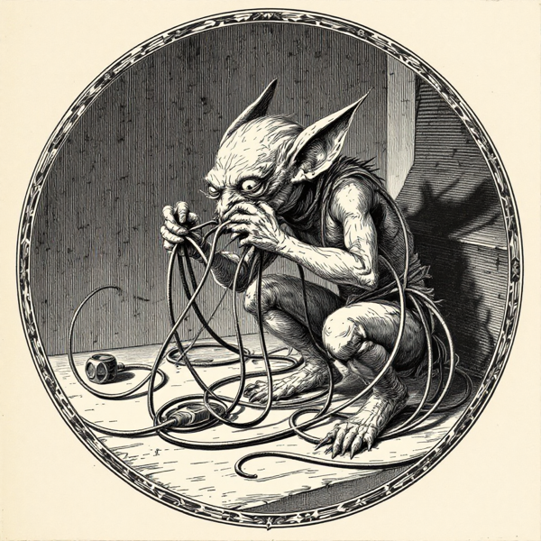

+++
title = "Dragging CUDA-Only AI onto a Mac Without Losing Your Mind"
date = 2026-06-04
images = ["/og/porting-ml-to-apple-silicon.png"]
thumbnail = "concepts/porting-ml-to-apple-silicon/d-together-collage.jpg"
description = "The recurring moves for dragging CUDA-only PyTorch onto an M-series Mac: device selection, MPS fallbacks, dtype landmines."
summary = "The recurring moves for getting a CUDA-first PyTorch project running on an M-series Mac - device selection, MPS fallbacks, dtype landmines, and dependency archaeology. The shared groundwork behind the individual ports."
tags = ["cuda", "apple-silicon", "mps"]
semantic_id = "GC3ZP4s_cZZksKAVTn3mMP6mfcZ9sAmu"
related_by_meaning = ["/deep-dives/audiocraft-apple-silicon/", "/glossary/mps/", "/glossary/vulkan/", "/practice/talkie-on-apple-silicon/"]
+++

Most interesting ML code was written by someone who assumed, the way you assume gravity, that
there was an NVIDIA GPU under the desk. The assumption is so total it's invisible. It's baked
into the imports, the install instructions, the one line three files deep that says
`device="cuda"` like it's reading a law of physics aloud.

Then you try to run it on a Mac, and the law of physics files a complaint.

Here's the good news, the thing nobody tells you because it's not heroic enough to brag about:
getting CUDA-first code onto an M-series Mac is not a research project. It's the **same handful
of moves, over and over.** Once you've done two of these ports you've basically done all of
them, the way once you've assembled two pieces of flat-pack furniture you've made peace with
the little hex key. So here are the moves in one place. The individual case studies
([PULSE](/deep-dives/reviving-pulse-apple-silicon/), AudioCraft, and the rest) link back here
instead of repeating them, because life is short and the hex key is always the same.

<!--more-->

A note on how I do this, since it matters and since I'd rather you hear it from me. I don't write
these patches. I direct an agent that does, and I judge what comes back - I'm the one who knows
what "running" is supposed to look like, not the one typing the diff. Read the "I" the way a
general contractor says "I built that house": I didn't lay a brick, I knew when a wall was
crooked, I knew who to send back.

And full disclosure on the bricks, because it's worse than you think: these ports are Python, and
Python is not my language. I'm a JavaScript/TypeScript person who spent fifteen years before that
writing crummy WordPress plugins, and to this day I see a variable wearing a `$` like a little hat
and think, yeah, that's fine, that's reasonable. I can _read_ Python the way you can read a menu
in a country you've never visited - enough to point at what I want - but write it fluently, in a
language where apparently no function has ever once volunteered the shape of its own arguments and
a comment is treated like a war crime? No. That part's the agent's, all of it. So read this less
as "kernel-engineer war stories" and more as a field guide to the six monsters you'll meet, in the
order you'll meet them, so you can recognize each one before it eats an afternoon.

## 1. Device selection: stop hardcoding the church you pray to


In PyTorch a **device** is just where a tensor's math actually runs: `cuda` (NVIDIA), `mps` (Apple's GPU), or `cpu`. `.cuda()` nails the code to one of them. Ask for "best available" instead and the same file runs on any machine.


The original code says `.cuda()` everywhere. On a Mac the GPU isn't CUDA, it's
[MPS](/glossary/mps/) - Apple's Metal-backed PyTorch device. So the first move is to quit
naming a specific god and just ask for the best one in the building.

The pattern is a tiny `device.py` that picks **MPS → [CUDA](/glossary/cuda/) → CPU** in that
order, with an environment-variable escape hatch (`SOMETHING_DEVICE=cpu`) for when you need to
force the slow-but-honest path to debug. Then you thread that one `DEVICE` value through the
whole codebase and exterminate every hardcoded `.cuda()` and `device="cuda"` you can find. It's
tedious, it's mechanical, it's the single most reliable hour you'll spend - and it's exactly
the kind of search-and-replace toil an agent should be doing while you watch.

## 2. The MPS fallback: the seatbelt you set once and forget



The missing op. Metal doesn't know every trick PyTorch does. The fallback hands that one move to the CPU and back, paying a toll at the border each time it runs.


[Metal](/glossary/metal/) does not implement every operation PyTorch knows about. Sooner or
later the model reaches for some niche op, finds a hole where Metal should be, and crashes.

The seatbelt is one environment variable: `PYTORCH_ENABLE_MPS_FALLBACK=1`. With it set, any op
Metal can't do quietly hands that one operation back to the CPU, runs it there, and returns to
the GPU like nothing happened. You usually want this on. The catch is that a fallback op drags
data across the CPU/GPU border every time it runs, and that border has a toll. If one
unimplemented op sits inside your hottest loop, your "GPU port" can somehow end up slower than
just running the whole thing on CPU - a machine paying tolls to commute to a job two desks
over. So: set the fallback for safety, then, if it's slow, hunt the op that's tripping it and
decide whether to pin it to CPU on purpose or rewrite around it.

## 3. Dtype landmines: the float64 that isn't there


**float64 / float32** is how many bits hold one number: double precision vs single. MPS flatly refuses float64. For inference, float32 is almost always plenty, so the fix is usually "tell it 32 is fine" and move on.


This is the crash you will hit first and curse most, so let's defuse it now: **MPS does not
support `float64`.** Not slowly, not with a warning - at all. Some library casually does a
double-[precision](/glossary/precision/) calculation that nobody on a CUDA box ever noticed, MPS hits it, and the whole
run face-plants with an error that does not, of course, say "I don't do float64." It says
something cryptic three abstraction layers away.

The fix is almost always "find the spot promoting to `float64` and tell it `float32` is fine,"
because for inference it virtually always is. While you're in there, know that the two
half-precision formats behave differently on Apple silicon too - [`bfloat16` and `float16`](/glossary/precision/) don't
have identical support or numerical behavior, and precision bugs love to hide in that gap. If
the model's output goes subtly insane rather than crashing outright, suspect a dtype. (If
"dtype" is a fog, the [tensor](/glossary/tensor/) entry is the five-minute version: it's just
what flavor of number is in the box.)

## 4. Dependency archaeology: the packages that only speak CUDA

Some Python packages aren't software so much as love letters to NVIDIA. `xformers`,
`bitsandbytes`, `triton` - these are CUDA down to the bone, they will not install on a Mac, and
the project treats them as mandatory because on the author's machine they were free.

The move is to make them **optional** - wrap the imports so their absence is a shrug, not a
death, and route to whatever non-CUDA path exists (often plain PyTorch [attention](/glossary/attention/) instead of
`xformers`, which is slower but real). Tangled up with this is straight-up archaeology: these
repos are frequently pinned to a five- or six-year-old Python and a PyTorch from a previous
geological era, and you have to drag the pins forward to something that runs on current Apple
silicon _without_ nudging the model into behaving differently. And don't forget the deps that
aren't pip at all - `ffmpeg`, `dlib`, and friends live at the OS level and have to be installed
the boring way (Homebrew) before any of the Python works.

## 5. Dead weights: the download links rotted years ago

Here's a failure that has nothing to do with chips and everything to do with time: the model
weights are gone. The README points at a Google Drive folder, a university server, an S3
bucket - and it 404s, because that link was somebody's grad-school account and they graduated.

Always **load weights from a local file first and download only as a fallback**, the opposite
of how these repos usually ship. Then go find where the canonical weights actually live now:
they've almost always migrated to HuggingFace, or to the maintaining library's own host
(dlib's model files, for instance). Half of "this old model doesn't work anymore" is not a code
problem at all. It's a missing-persons case.

## 6. Sanity-checking the port: prove it, don't vibe it



The port that lies. "It ran" is not "it's right." Run the same input through CPU and GPU and prove the numbers match. Confident garbage looks exactly like success until you check.


The most dangerous state is **"it ran without crashing,"** because that feels like success and
isn't. MPS will happily produce numbers that are quietly wrong - a dtype quirk, a fallback op
returning something subtly off - and a model emitting confident garbage looks identical to a
working one until you check.

So check. Run a tiny forward pass on CPU and on MPS with the same input and confirm the outputs
match within a small tolerance - that's your proof the GPU path is honest, not just fast. Then
set realistic expectations: a Mac's unified memory is generous, but
[parameter](/glossary/parameters/) count still decides what's usable. A model that's a breeze
on a 40GB datacenter card might run on your laptop the way a tour bus runs down a bike path,
technically forward motion, deeply unadvisable. Knowing which size is _actually_ usable on
_your_ Mac is the last move, and it's the one that turns "I got it running" into "I actually
use this."

---

That's the whole hex key. Six monsters: a hardcoded device, a missing op, a forbidden number, a
CUDA-only dependency, a dead download, and a port that lies about working. Every one of these
ports is just those six in a different costume. Recognize the costume and the fight gets
boring - which, for this kind of work, is exactly the goal.

**Case studies are on the way** - each one these same six monsters meeting a specific victim:
PULSE, a 2020 face upscaler dragged out of its CUDA grave, and AudioCraft, making music with no
NVIDIA anywhere in the room. They'll land here as they go live.

<!-- Re-link the case studies above once their drafts publish. Done 2026-07-03:
     /deep-dives/reviving-pulse-apple-silicon/ (live Jun 22). Still waiting:
     /deep-dives/audiocraft-apple-silicon/ (draft). -->
