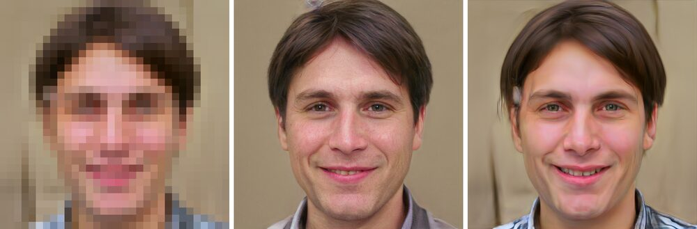

+++
title = "Necromancy for Neural Nets: Bringing PULSE Back on a Mac"
date = 2026-06-22
summary = "Getting a 2020 StyleGAN upsampler running on a Mac - dead download links, CUDA-only assumptions, and a six-year-old conda env, all dragged into the present."
description = "Reviving PULSE, a 2020 StyleGAN face upsampler, on an Apple Silicon Mac: dead weights, CUDA-only code, a silent failure mode."
images = ["/og/reviving-pulse-apple-silicon.png"]
+++

[PULSE](https://github.com/eaglstun/pulse) (CVPR'20) turns a blurry 16×16 face into a
sharp 1024×1024 one. It doesn't paint the detail back in pixel by pixel. Instead it searches a
[GAN](/glossary/gan/)'s [latent space](/glossary/latent-space/) for a realistic face that,
shrunk back down, matches the blurry input. The catch: the original code only runs on an NVIDIA
GPU, and the model weights it needs are long gone from the internet. This is the story of
getting it running on an M-series Mac in 2026.

<!--more-->



Part of this job is the same every time: pick the right device, fall back to MPS, dodge the
dtype landmines, dig the project out of its six-year-old dependencies. Those moves show up in
every one of these ports, and I wrote them up once in
[Dragging CUDA-Only AI onto a Mac](/deep-dives/porting-ml-to-apple-silicon/). This post is the
other half: the monsters that wore a costume only this project would wear.

## What PULSE actually does

Most super-resolution works the obvious way: train a network on millions of
(blurry, sharp) pairs until it learns to map one to the other. PULSE doesn't do that, and the
sleight of hand is the whole reason it's worth reviving.

It never trains anything. It takes a StyleGAN generator that is already trained - a frozen
machine that turns about 512 numbers into a photorealistic face - and then **adjusts those input
numbers by gradient descent, leaving the machine itself untouched.** Normal training does the
reverse: it tweaks the machine and leaves the inputs alone. PULSE flips that. It hunts the
[latent space](/glossary/latent-space/) for a set of numbers whose 1024×1024 face, shrunk back
down, lands on your blurry input. No paired data. No training run. Just search.

This has a consequence people find unsettling, and it matters enough to say plainly:
**PULSE does not recover the original face. It invents a new one.** The detail the blur threw
away is gone for good. What comes back is a believable face that happens to match the blur. Run
it twice and you get two different people who both shrink down to the same photo. The original
authors were blunt about what this means. PULSE **cannot** be used to un-blur and identify a
real person. And the search has a known bias: it leans toward the kinds of faces that were
common in StyleGAN's training data. Any resemblance to a real person is a coincidence, and also,
mathematically, the entire point.

So reviving PULSE isn't reviving a face-recovery tool. It's reviving a beautifully weird piece
of math: a search that walks across a whole landscape of imaginary people.

## The 2026 problem

The code is from 2020, and 2020 is a foreign country. The original `environment.yml` pinned
**Python 3.8 and PyTorch 1.5** to exact 2020 builds, plus a pile of packages the code never
imports (matplotlib, pandas - the usual research-repo barnacles). None of those old versions
install cleanly on a modern machine, and half of them never mattered.

And the weights - the actual trained "brain" - were hosted on Google Drive links that died
years ago. PULSE needs three files to run: `synthesis.pt` and `mapping.pt` (its repackaged
StyleGAN CelebA-HQ weights) and dlib's `shape_predictor_68_face_landmarks.dat` for finding and
straightening the face. The Drive links are dead. A later mirror is dead. **The download path
is a tombstone**; a fresh clone just errors out reaching for files that no longer exist
anywhere the code knows to look.

## The fork changes

Three moves, and they map onto the generic playbook monsters - they just showed up here in
PULSE costumes.

**Device auto-select (`device.py`).** The original says `device="cuda"` like it's reading a
law of physics. The fix is one tiny module that picks the best backend in the building:
**CUDA → [MPS](/glossary/mps/) → CPU** - and an environment-variable escape hatch for when an
MPS op isn't implemented yet:

```python
def get_device():
    forced = os.environ.get("PULSE_DEVICE")
    if forced:
        return torch.device(forced)
    if torch.cuda.is_available():
        return torch.device("cuda")
    if hasattr(torch.backends, "mps") and torch.backends.mps.is_available():
        return torch.device("mps")
    return torch.device("cpu")
```

Every module imports that one shared `device`. The real labor was hunting down the hardcoded
`'cuda'` strings scattered three files deep - the 1-million-sample tensor PULSE draws to
estimate the latent distribution, the `(batch, 18, 512)` latent itself, every noise tensor,
the loss builder. All of them said `device='cuda'`; all of them now say `device=device`.
`PULSE_DEVICE=cpu python run.py` forces the slow-but-honest path when you need to know whether
a bug is yours or [Metal](/glossary/metal/)'s.

**Local weights, download as fallback.** Instead of fetching from dead links, `PULSE.py` and
`align_face.py` now **load the three files straight from the repo root if they're present**,
and only attempt a download if they're missing. The dead URLs are kept as commented context,
which is the honest thing to do - a reader deserves to see where the bodies are buried. One
nice accident of the original design: `gaussian_fit.pt` (the cached mean/std of the mapping
network over a million samples) is committed to the repo, which means `mapping.pt` is only
needed to _regenerate_ that file. In practice you can run the whole thing with just
`synthesis.pt`.

**Modernized `pulse.yml`.** Rebuilt on **Python 3.13 / PyTorch 2.10 / torchvision 0.25**, plus
only the libraries the code actually imports (`numpy`, `scipy`, `pillow`, `requests`, `dlib`)
and `cmake`, which you need _before_ creating the env because dlib compiles against it.
Crucially, all three backends now run an **identical torch** - the CUDA box and the Mac aren't
on different stacks, so a result that reproduces is a real result, not a version artifact.

## The two gotchas that were pure PULSE

Generic monsters aside, two problems were specific enough to this code that they're the actual
reason this post exists.

**The dtype hack that only spoke CUDA.** The differentiable downscaler in `bicubic.py` built
its filter tensors by _string-formatting the device name into a type_:

```python
filters1 = self.k1.type('torch{}.FloatTensor'.format(self.cuda))
```

On CUDA that interpolates to `torch.cuda.FloatTensor`. There is no
`torch.mps.FloatTensor` - the whole `torch.<device>.FloatTensor` naming scheme is a CUDA-era
fossil. The fix is the modern idiom: register the kernels as module buffers (so they follow the
module across `.to(device)`) and `type_as` the input tensor so dtype and device stay aligned
automatically. A classic dtype landmine, wearing a 2020 string-formatting trick as a disguise.

**The [epsilon gate](/glossary/epsilon-gate/) that silently produced nothing.** This is the good one. PULSE's loop yielded
its result only if the downscaling loss got within `eps` (default `2e-3`); otherwise it printed
_"Could not find a face that downscales correctly within epsilon"_ and yielded **nothing at
all.** That threshold was tuned on CUDA. Run the same optimization on MPS or CPU - where the
arithmetic differs in the last bits and convergence lands a hair short - and a perfectly good
run would finish having written **zero output files.** Not an error. Not a warning you'd notice.
Just an empty `runs/` directory and a confused afternoon. The fix is to always yield the best
image the search found and treat `eps` as a _stopping hint_, not a _publication gate_. A
convergence threshold someone hardcoded for their GPU is exactly the kind of assumption that
turns into a silent failure on yours.

(There's a smaller one too: `run.py` wraps the model in `DataParallel`, which only makes sense
for multi-GPU CUDA and isn't supported on MPS - so the fork only wraps when it actually sees
multiple CUDA GPUs, and otherwise moves the input onto the device itself.)

## Results, and where the search wanders off

Once it ran, the fun part was confirming the _math_ survived the move - that I'd ported the
machine, not just gotten it to stop crashing. The cleanest way to prove that is a parameter
sweep: same input, same seed, change exactly one knob, watch the result move the way the paper
says it should.

Here's the headline case - a face shrunk to **16×16** and upscaled 64× (the paper's marquee
demo), with one parameter changed per row:

| Run                               | What changed                          | Final `L2` | Final `GEOCROSS` | Converged |
| --------------------------------- | ------------------------------------- | ---------- | ---------------- | --------- |
| baseline                          | defaults (`100*L2+0.05*GEOCROSS`, W+) | `0.0020`   | `0.608`          | step 100  |
| `-tile_latent`                    | one shared latent (W) not 18 (W+)     | `0.0020`   | `0.000`          | step 28   |
| `-loss_str "100*L2+1.0*GEOCROSS"` | 20× stronger realism penalty          | `0.0020`   | `0.027`          | step 100  |
| `-loss_str "100*L2"`              | realism penalty removed               | `0.0020`   | -                | step 20   |
| `-noise_type fixed`               | noise frozen, not optimized           | `0.0020`   | `0.574`          | step 100  |


The tell is the first column: **every variant reaches the same `L2` (`0.0020`).** Each one
shrinks back down onto the input equally well. They are all valid answers. What the knobs change
isn't _whether_ it matches, it's _which believable person you land on_ while matching. Drop the
`GEOCROSS` realism term and the search finishes fastest (step 20), because now it only has to
match the pixels. It is also the most free to wander away from real-looking faces and hand you
something subtly off. That gap between "matches the pixels" and "is a face you'd believe" is the
whole point of PULSE, and a hard 64× input pulls it wide open. Look back at the strip: "no
GEOCROSS" is the one that wandered off to a different person. (The
[repo's README](https://github.com/eaglstun/pulse) runs the same sweep on an easier 32x32 input,
where every knob lands on near-enough the same face. The freedom only opens up when the input
gets this thin.)

The reanimation worked. A six-year-old research script that assumed a Linux box with an NVIDIA
card under the desk now searches a landscape of imaginary faces on a laptop with no fan noise,
and lands on the same numbers it did in 2020. The body's different. The ghost is intact.
